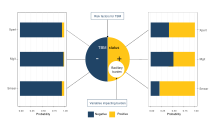

# Introduction

*Tuberculous meningitis (TBM)* is the most severe form of tuberculosis. Diagnosing TBM is notoriously challenging, with microbiological confirmation requiring identification of *Mycobacterium tuberculosis* in paucibacillary cerebrospinal fluid (CSF). In addition to widely used confirmatory methods of CSF testing for *M. tuberculosis* such as Ziehl-Neelsen (ZN) staining, GeneXpert MTB/RIF (Xpert), and Mycobacterial culture, additional information may increase the likelihood of a diagnosis of TBM. Such characteristics are illustrated in the uniform case definition for TBM[@marais2010] where, in the absence of positive microbiological tests, an increased certainty of TBM is assigned in the presence of particular clinical, CSF, and imaging findings, or with evidence of non-neurological *M. tuberculosis*.

In the absence of a gold standard for TBM diagnosis, the uniform case definition has been widely adopted, particularly for the evaluation of new index diagnostic tests. However, the uniform case definition was developed as a standardised approach to reporting TBM research, rather than a gold standard for TBM diagnosis. When categorising cases of suspected TBM, the uniform case definition allocates cases to one of four levels; *Definite*, *Probable*, *Possible*, and *Not TBM*, with both *Probable* and *Possible* each encompassing a numerical score range where higher scores increase the probability of a diagnosis of TBM. All *Probable* cases do not therefore have the same probability of having TBM. *Definite TBM* incorporates microbiological tests, which, in the case of mycobacterial culture, may not return a positive result for several weeks. The best combination of these characteristics to diagnose that represents TBM, whilst including no cases of *non-TBM*, is not known and probably lies beyond the use of 4 levels. True TBM cases are likely represented by all *Definite* cases, most *Probable* cases, and some *Possible* cases. Furthermore, some amongst these characteristics are not always available, particularly in resource-limited settings, consequently lead to arbitrary assumptions and reduce overall capability.  <!---On the other hands, due to not being developed upon discussions consensuses where a mere change does need more time and efforts, several statistical models can be re-fitted basing on one same dataset with different covariables, hence have more flexibility and adaptability in different scenarios. *(in case this is ambiguous: this closely links to one of our objectives where we build a simplified score table that uses only clinical and demographic data, for resources-limited settings and quick screening)*-->

An alternative is to combine characteristics in a statistical diagnostic model. In the absence of a gold standard, classical regression models do not suffice. *Latent Class Analysis (LCA)* is a technique which has been used in settings where a gold standard does not exist. This model assumes that the population can be split into different groups, and quantifies the probability to belong to each group based on individual characteristics. LCA is common in social science and psychology to detect different hidden traits[@Weller2020]. Recently, it has been adopted in several diagnostic studies, especially in Tuberculosis[@stout2018; @adams2019; @schumacher2016; @lahuerta-marin2018]. <!--The classical LCA usually requires indicators to follow different biological pathways, which hinders it applicability. The introduction of random effects and Bayesian approach has brought more flexibility to the model [@qu1996; @toft2005; @menten2008].-->

```{r classic-lca, fig.cap = "Design of classic Latent Class Analysis with two unobserved classes 1 and 2 and three iid. binary manifest variables (test 1, test 2, and test 3). Distributions of manifest variables in both classes are generated for demonstration only", out.width='90%', fig.id = "classic-lca", dpi=300, fig.cap.style = "Image Caption", fig.align='center', include=FALSE}
# knitr::include_graphics("includes/graph1.jpg")
# 
fig_svg <- cowplot::ggdraw() + 
  cowplot::draw_image(magick::image_read_svg("includes/classicLCA.svg", width=212*5, height=159*5))
plot(fig_svg)
```

In this analysis, we implemented a latent class model to *(1)* re-evaluate the performance, namely sensitivities and specificities, of current TBM confirmatory methods - ZN Smear, Xpert, and mycobacterial culture - against actual TBM status, taking into account the imperfection in current diagnosis; *(2)* provide an alternative to the the diagnostic scoring system that estimates the probability of having TBM based on individual characteristics and compare both approaches.

As secondary objectives, our analysis also aim to build a simplified scoring system which only needs clinical and demographic information but has the capacity to approximate the full system's output - so that TBM risk can be calculated at admission. We also estimate a latent representation of individual bacillary burden given that they get TBM which may impact the tests results.
