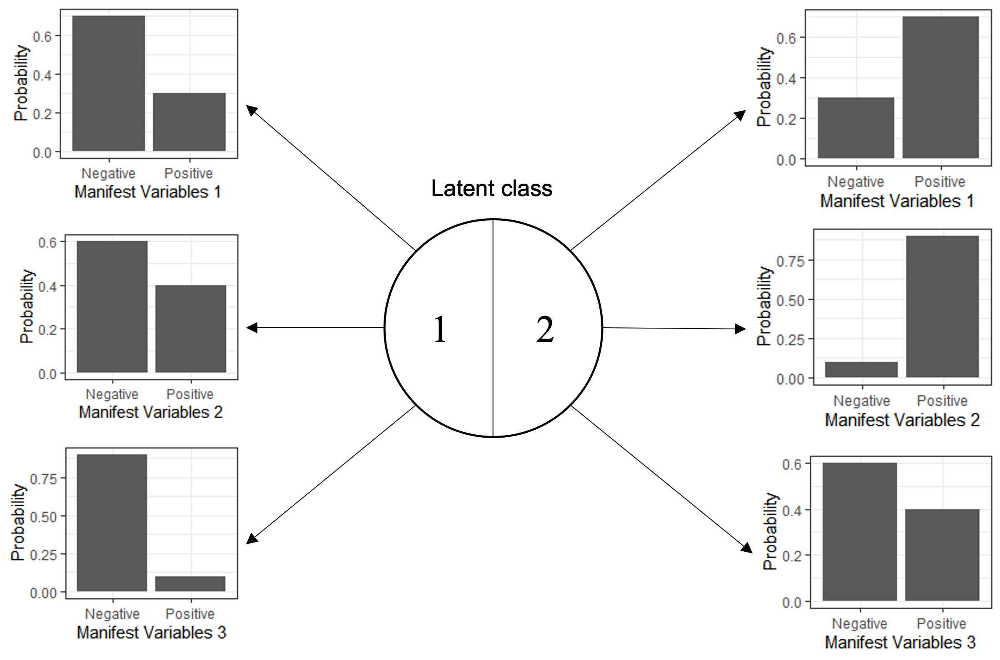

```{r setup, include=FALSE}
options(tinytex.engine_args = '-shell-escape')
knitr::opts_chunk$set(echo = FALSE, dpi=300) #, dev = 'png'
flextable::set_flextable_defaults(fonts_ignore=TRUE, font.size=9, table.layout='fixed')
```

```{r library, include=FALSE}
library(gtsummary)
library(dplyr)
library(magrittr, include.only = '%$%')
library(ggplot2)
library(patchwork)
library(officedown)

# All the misc functions go here.
my_fn <- new.env()

## Add labels accross a tbl
my_fn$add_labels <- \(.data, ...){
  cols <- list(...)
  for (i in seq_along(cols))
    attr(.data[[names(cols)[i]]], 'label') <- cols[[i]]
  .data
}

## Register a knit engine for stan code highlight
my_fn$stan_knitr_engine <- \(options){
  out <- c('\\begin{Shaded}','\\begin{minted}{stan}', options$code, '\\end{minted}','\\end{Shaded}')
  options$echo <- FALSE
  options$results <- "asis"
  knitr::engine_output(options, options$code, out)
}
knitr::knit_engines$set(stan_code = my_fn$stan_knitr_engine)

## Gist to number equations
## https://gist.github.com/mcanouil/eb75057432ff77846f4273d8808e615a
my_fn$is_docx_output <- function (fmt = knitr:::pandoc_to()) {
  if (length(fmt) == 0) {
    return(FALSE)
  } else {
    return(fmt == "docx")
  }
}

my_fn$numberEq.docx <- function (eq, lab, envir = docx.eqcounter) {
  assign(x = "counter", value = get(x = "counter", envir = envir)+1, envir = envir)
  assign(x = gsub("eq:", "", lab), value = get(x = "counter", envir = envir), envir = envir)
  lab <- get("counter", envir = envir)
  return(c('$$', eq, '\\;\\;\\;\\;(', lab, ')', '$$'))
}
my_fn$labEq.docx <- function (lab, envir = docx.eqcounter) {
  return(paste0('(', get(x = gsub("eq:", "", lab), envir = envir), ')'))
}

docx.eqcounter <- new.env()
docx.eqcounter$counter <- 0
  
# Register a knit engine for formula
my_fn$aligned_formula_knit <- \(options){
  out <- my_fn$numberEq.docx(options$code, lab = options$fml.lab)
  options$echo <- FALSE
  options$results <- "asis"
  knitr::engine_output(options, options$code, out)
}
knitr::knit_engines$set(aligned_formula = my_fn$aligned_formula_knit)


# Global theming for ggplots
my_fn$plot_theme <-
  theme(text = element_text('serif', size = 9), 
        plot.tag = element_text('serif', size = 9),
        axis.text.y = element_blank(),
        axis.ticks.y = element_blank())

```

```{r data, include=FALSE}
data_dir <- '../../data/cleaned/'
load(file.path(data_dir, 'data_input.Rdata'))
data_dirty <- readRDS(file.path(data_dir, 'data_dirty.RDS'))
load(file.path(data_dir, '..', 'export', 'm3_summary.Rdata'))
load(file.path(data_dir, '..', 'export', 'm3_plot.Rdata'))
```

# Introduction

*Tuberculous meningitis (TBM)* is the most severe form of tuberculosis. Diagnosing TBM is notoriously challenging, with microbiological confirmation requiring identification of *Mycobacterium tuberculosis* in paucibacillary cerebrospinal fluid (CSF). In addition to widely used confirmatory methods of CSF testing for *M. tuberculosis* such as Ziehl-Neelsen (ZN) staining, GeneXpert MTB/RIF (Xpert), and Mycobacterial culture, additional parameters may increase the likelihood of a diagnosis of TBM. Such characteristics are illustrated in the uniform case definition for TBM [@marais2010] where, in the absence of positive microbiological tests, an increased certainty of TBM is assigned in the presence of particular clinical, CSF, and imaging findings, or with evidence of non-neurological *M. tuberculosis*.

In the absence of a gold standard for TBM diagnosis, the uniform case definition has been widely adopted, particularly for the evaluation of new index diagnostic tests. However, the uniform case definition was developed as a standardised approach to reporting TBM research, rather than a gold standard for TBM diagnosis. When categorising cases of suspected TBM, the uniform case definition allocates cases to one of four levels; *Definite*, *Probable*, *Possible*, and *Not TBM*, with both *Probable* and *Possible* each encompassing a numerical score range where higher scores increase the probability of a diagnosis of TBM. All *Probable* cases do not therefore have the same probability of having TBM. *Definite TBM* incorporates microbiological tests, which, in the case of mycobacterial culture, may not return a positive result for several weeks. The best combination of these 4 levels that represents TBM, whilst including no cases of *non-TBM*, is not known and probably lies beyond the use of 4 levels. True TBM cases are likely represented by all *Definite* cases, most *Probable* cases, and some *Possible* cases. On the other hands, due to not being developed upon discussions consensuses where a mere change does need more time and efforts, several statistical models can be re-fitted basing on one same dataset with different covariables, hence have more flexibility and adaptability in different scenarios. *(in case this is ambiguous: this closely links to one of our objectives where we build a simplified score table that uses only clinical and demographic data, for resources-limited settings and quick screening)*

*Latent Class Analysis (LCA)* is a statistical technique which has been adopted in settings where a gold standard does not exist, in place of which are a set of mutually independent tests. This model utilies a list of different indicators to divide the population into separated group. LCA is commonly used in social science and psychology to detect different hidden traits [@Weller2020]. Recently, it has been gradually adopted in several diagnositic and prognosis studies, especially in Tuberculosis [@stout2018; @adams2019; @schumacher2016; @lahuerta-marin2018] given the limitation of current toolsets. Classical LCA all test manifest variables are mutually independent, which might not hold in most cases hence hinders the applicability of such design. The introduction of random effects and Bayesian approach has brought more flexibility to the model [@qu1996; @toft2005; @menten2008].

```{r classic-lca, fig.cap = "Design of classic Latent Class Analysis with two unobserved classes 1 and 2 and three iid. binary manifest variables (test 1, test 2, and test 3). Distributions of manifest variables in both classes are generated for demonstration only", out.width='90%', fig.id = "classic-lca", dpi=300, fig.cap.style = "Image Caption", fig.align='center', include=FALSE}
# 
# 
fig_svg <- cowplot::ggdraw() + 
  cowplot::draw_image(magick::image_read_svg("includes/classicLCA.svg", width=212*5, height=159*5))
plot(fig_svg)
```

In this analysis, we implemented LCA model to *(1)* re-estimate the latent performances, namely sensitivities and specificities, of current TBM confirmatory methods - ZN Smear, Xpert, and mycobacterial culture - against actual TBM status, taking into account the imperfection in current diagnosis; *(2)* make a re-adjustment to the the diagnosis scoring system, basing on statistical model, providing estimations of individual chance of having TBM.

As secondary objectives, our analysis also aim to build a simplified scoring system which only needs clinical and demographic information but has the capacity to approximate the full system's output - so that TBM risk can be calculated at admission. We also estimate a latent representation of individual bacillary burden given that they get TBM which may impact the tests results.

# Methods

## Participants

Data used for this analysis were extracted from an observational study of brain infection conducted at the Hospital for Tropical Diseases (HTD), Ho Chi Minh City, Vietnam, a large centre providing secondary and tertiary treatment for a wide range of tropical infections [@thwaites2002]. This study received ethical approvals from HTD and Oxford Tropical Research Ethics Committee [@donovan2020]. All participants were enrolled between 29th August 2017 and 22nd January 2021. Inclusion criteria included a minimum age of 16 years old, with suspected brain infection, admitted to a neuro-infection ward, and undergoing lumbar puncture at baseline as a routine diagnostic procedure. Patients were ineligible for enrolment if performing a lumbar puncture was contraindicated, or if informed consent to join the study was not given (by the patient, or by a relative if the patient lacked capacity to consent). Specifically for this analysis, we also excluded patients with contaminated MGIT results and with no subsequent culture in the first week since admission. Overall patient characteristics, with respects to test results, are shown in table \@ref(tab:test-bl-tbl).

## Data collection and testing procedures

For all participants, demographic data and medical history were recorded. HIV testing was performed on a case-by-case basis by the treating clinician. Patients who admitted with immunological-deficit-related condition or involved in high risk social activities were tested for HIV. Patients with either a known HIV positive status, or a positive HIV test result, were considered HIV positive. Patients underwent clinical examination and laboratorial investigations according to main study protocol, including: blood test, sputum, and lumbar puncture, unless contra-indicated. Cerebro-spinal fluid (CSF) was obtained by lumbar puncture, with CSF white blood cells and cellular differential, CSF protein, CSF glucose (with paired blood glucose), and CSF lactate routinely measured. Optimally 6mls CSF was used for mycobacterial testing unless less CSF was available (in which case mycobacterial testing was still performed). Confirmatory tests for TBM performed on CSF and used for this analysis were Ziehl--Neelsen staining and smear (ZN Smear), mycobacterial culture using Mycobacteria Growth Indicator Tube (MGIT), and Xpert or Xpert MTB/RIF Ultra (XpertUltra). Given Xpert and XpertUltra were considered diagnostically comparable in a recent comparative study from this centre using a subgroup of these data [@donovan2020], Xpert and XpertUltra were considered the same in this analysis and, are both denoted as Xpert. Confirmatory mycobacterial testing was performed if TBM was suspected by the treating clinician.

Methods of CSF processing have been described elsewhere [@nhu2013, @donovan2020], however, briefly; CSF samples were centrifuged at 3000g for 15 minutes, and most of the CSF supernatant was removed. The CSF deposit was resuspended in 500µL of remaining supernatant, with this resuspended pellet then used for ZN smear (100µL), MGIT (200µL), and either Xpert or XpertUltra (200 µL).

All patients received appropriate anti-TB chemotherapy regimens according to national and local treatment guidelines, depending on the diagnosis, without any interference from the study. At the time of discharge or death, all patients received a final diagnosis. If at least one of ZN Smear, Xpert, Xpert Ultra, or MGIT, was positive at any time during the follow-up, the patient would be considered confirmed TBM; otherwise, if TBM was clinically suspected and treated, with confirmatory microbiological tests negative, the patient would be considered suspected TBM. If the patient recovered without anti-TB chemotherapy they would be reassigned to another diagnosis (i.e. not TBM).

In the instance of repeat CSF sampling (performed based on clinical need), only the first samples with at least 3mls of collect CSF collected not later than the first week since admission were used. Results of haematological and biochemical parameters, and of ZN Smear, Xpert, Xpert Ultra, and MGIT, were taken from one same CSF samples (in addition to the paired blood glucose).

## Statistical analysis

### Latent class regression model

We conducted a Bayesian Latent Class Model in which three aforementioned TBM confirmatory tests (ZN Smear, MGIT, and Xpert) were used as manifest variables and target latent condition is the actual disease status (TBM or not TBM). All three tests are detection tool via direct visualisation under microscope (ZN Smear), via their DNA (Xpert), or via grown culture (MGIT). Linear predictors for the latent class were chosen according to background knowledge of potential risk factors [@marais2010] and are summarised in table \@ref(tab:predictor-tab). We added three extra counter-predictors: (1) CSF oeosinophil count - a strong bio-marker for oeosinophilic meningitis, a condition usually caused by parasitic helminths; (2) Cryptococcus Antigen/Indian Ink - a confirmatory test for parasitic infection; and (3) CSF erythrocyte count - an independent marker for traumatic lumbar puncture, in which case we also made correction to white cell counts and biochemical features, as suggested by [@greenberg2008; @nigrovic2011; @mehl1986]. Details of model design were summarised in the supplementary document.

```{r predictor-tab, out.width="100%",  tab.cap="Contribution of different features to TBM prevalence and patients' mycobacillary burden for each model mentioned in table \\@ref(tab:model-archs), based on background knowledge. Cell values are the expected association and level of confidence is; empty cells imply no association", tab.id = "predictor-tab", label='tab0'}
tibble::tribble(
  ~ 'Predictor'                    , ~ 'TBM prevalence', ~ 'Bacillary Burden',
  'Age'                            , '+, weak'  , ''                  ,
  'HIV Status'                     , '+, strong', '+, weak'    ,
  'Past TB contact'                , '+, weak'  , ''                  ,
  'TB-suggested symptoms'          , '+, weak'  , ''                  ,
  'Local motor deficit'            , '+, weak'  , ''                  ,         
  'Cranial nerve palsy'            , '+, weak'  , ''                  ,
  'Days from onset'                , '+, weak'  , ''                  ,
  'PTB/X-Ray'                      , '+, weak'  , ''                  ,
  'MTB/X-Ray'                      , '+, strong', ''                  ,
  'GCS'                            , '+, weak'  , ''                  ,
  'Cryptococcus Antigen/Indian Ink', '-, strong', ''                  ,
  'Blood Glucose'                  , '-, weak'  , ''                  ,
  'CSF Glucose'                    , '-, weak'  , '?, weak'     ,
  'CSF Lymphocyte Count'           , '+, weak'  , '-, weak'    ,
  'CSF Total While cell Count'     , '+-^[Risk of TBM peaks with intermediate CSF white cell count], weak' , '+, weak'    ,
  'CSF Protein'                    , '+, weak'  , '+, weak'    ,
  'CSF Lactate'                    , '+, weak'  , '+, weak'    ,
  'CSF Oeosinophil Count'          , '-, strong', ''                  ,
  'CSF RBC Count'                  , '?, weak'   , ''                 
) |>
  flextable::flextable() |>
  ftExtra::colformat_md(2) |>
  # flextable::footnote(i=16, j=2, 
    # value=flextable::as_paragraph('')) |>
  flextable::width(j=1, width=2) |>
  flextable::width(j=2:3, width=1.2) |>
  flextable::theme_zebra() |>
  flextable::bold(bold = FALSE, part = "footer") |>
  flextable::italic(italic = TRUE, part = "footer" )
```

As they are usually right-skewed, prior to the analysis, most continuous variables were transformed to logarithmic scale and subsequently centred and divided by their standard deviations. Glasgow Coma Score (GCS) and its components (Voice - GCSV, Eyes - GCSE, and Muscle - GCSM) were translated to *Reversed GCS* (table \@ref(tab:gcs-tab)). Binary variables were dummy-coded into 0 for "Negative"/"No" and 1 for "Positive"/"Yes".

```{r gcs-tab, out.width='100%', tab.id='gcs-tab', tab.cap='Conversion table from clasic Glasgow Coma Score (GCS) to Reversed GCS (RGCS)'}

tibble::tribble(
  ~ Feature,                     ~ Response, ~ GCS, ~ RGCS,
  'Eye response',        'Open sponatenously', 4, 0,
  'Eye response',     'Open to voice command', 3, 1,
  'Eye response',              'Open to pain', 2, 2,
  'Eye response',               'No eye open', 1, 3,
  'Verbal response',             'Orientated', 5, 0,
  'Verbal response',               'Confused', 4, 1,
  'Verbal response',     'Inappopriate words', 3, 2,
  'Verbal response','Incomprehensible sounds', 2, 3,
  'Verbal response',     'No verbal response', 1, 4,
  'Motor response',            'Obey command', 6, 0,
  'Motor response',         'Localising pain', 5, 1,
  'Motor response',    'Withdrawal from pain', 4, 2,
  'Motor response',                 'Flexing', 3, 3,
  'Motor response',               'Extending', 2, 4,
  'Motor response',       'No motor response', 1, 5
) |>
  flextable::flextable() |>
  flextable::merge_v(j = 1) |>  
  flextable::width(j=1, width=2) |>
  flextable::width(j=2, width=2)
```

Compared to the uniform case definition, we also made a change to *Past TB contact*, in which we hypothesise that by editing the original question from "Past contact with TB patients within the past recent year" into "Past *noticeable* contact with TB patients within the past recent year", we would be able to imply all "Unknown" answer as a "No". In the analysed data, no brain imaging was taken, hence not included.

```{r model-archs, tab.cap="Model architectures and extensions", tab.id="model-archs"}
model_archs <-
  data.frame(
    Model=1:5,
    Def=c(
      'No bacillary burden; everyone in the same class has equal risk of tested positive',
      'Added individual bacillary burden; impacts of bacillary burden on test results are the same',
      'Impacts of bacillary burden are different for different tests',
      'Added technical fluctuation as a second random effect; fixed effects only contributes to bacillary burden',
      'Added fixed effects for technical fluctuation'
    )
  ) 

model_archs |> 
  flextable::flextable() |>
  flextable::set_header_labels(
    Model='Model', 
    Def='Base definition (Only added effects compared to lower number are mentioned)'
  ) |>
  flextable::width(j=1, width=.5)|>
  flextable::width(j=2, width=5) |>
  flextable::theme_zebra()
```

Basic desgins for all models is shown in figure \@ref(fig:skeleton-model). Similar to @schumacher2016, we used a stepwise approach where we incrementally added up more flexibility and lifted more constraints (\@ref(tab:model-archs)). Note that only CSF White Cell count was modeled via a quadratic effect, as suggested by @marais2010.

```{r skeleton-model, fig.show='hold', out.width="100%", fig.align="center", fig.cap="Model basic design. Bacillary burden is only included in model 2+", fig.id='skeleton-model'}

fig_svg <- cowplot::ggdraw() + 
  cowplot::draw_image(magick::image_read_svg("includes/classicLCA.svg", width=212*5, height=159*5))
plot(fig_svg)
```

```{dot skeleton-model-old, fig.show="hold", out.width="100%", out.height="5cm",  fig.align="center", fig.cap="Model skeleton. Bacillary Burden is only available in model 2+", fig.id="skeleton-model", include=FALSE}

digraph m1{
    rankdir = LR;
    compound = true;
    graph[dpi = 300, fontname="CMU Serif"];
    node[fontname = "CMU Serif"];

    subgraph cluster_pred{
        label = < <B>Predictors</B> >;
        bgcolor = lightgrey;
        node[style=filled fillcolor=white shape=rectangle];
        X1; X2; X3;
    }

    subgraph cluster_latent{
        rank=same;
        bgcolor = "#98cde2";
        label = < <B>Latent Space</B> >;
        node[shape=ellipse style=filled fillcolor=white];
        subgraph zzz{
            C[label=TBM];
            I[label="Bacillary burden" style="filled, dashed"];
            C -> I[label="+"];
        }
        
    }
    
    subgraph cluster_manifest{
        node[shape=box];
        label = < <B>Manifest variables</B> >;
        Y1[label="ZN Smear"];
        Y2[label="MGIT"];
        Y3[label="Xpert"];
    }

    {X1 X2 X3} -> C;
    C -> {Y2}[lhead="cluster_manifest"];
    X3 -> I -> Y3[lhead="cluster_manifest"];
}

```

By protocol, most patients with very high chance of or evidently diagnosed with different diseases were not tested with TBM confirmation assays, we assumed that patients who had no TBM confirmation tests are all negative, because these tests are assumed to have high specificity [@nhu2013, @heemskerk2018]. Missing predictors were handled case by case basing on their expected missing mechanisms (table \@ref(tab:missing-handling)). In case they were expected to be Missing At Random (MAR), we performed a model-based imputation.

*Normal* distribution with appropriate means and standard deviations were chosen for TBM confirmatory tests sensitivity and specificity, on the logit scale, so that they could cover past estimations from different studies involving Vietnamese cohort [@thwaites2004; @nhu2013; @heemskerk2018] (figure \@ref(fig:mv-priors)). Weakly informative priors for True Positive Rate (TPC = Sensitivity) given the discrepancies between different research. We also used *Normal* distribution for other linear covariates, but with weakly informative configurations.

All model performances were estimated and compared by (1) expected log point-wise predictive density (elpd [@vehtari2016]), (2) calibration [@rms; @VanCalster2019], and (3) Receiver Operating Characteristic (ROC) curve and corresponding Area Under the Curve (AUC). All metrics were estimated using a pooled dataset held out from 5 repetitions of 20-fold cross validation. Pair-wise residual correlation were plotted to validate the local independence assumption, after correction for local effects [@qu1996; @schumacher2016]. For demonstration, we visualised class-wise predicted probability density plots depicting how separable predicted values are between two classes. We also used the diagnosis at discharge (if available at time) as a pseudo-gold standard to visualise the correlation of our model-based prediction and delayed clinical diagnosis. 

```{r mv-priors, fig.cap="Density plots for prior distributions and their adherence to prior knowledge of sensitvity and specifity for TBM confirmation tests, against then-made clinical diagnosis. Note that Thwaites 2004 was descriptive only while ZN and Culture in Nhu 2013 were references hence no Confidence Interval", warning=FALSE,  fig.align='center', out.width='90%', fig.id="mv-priors", fig.height=8, dpi=300 }
sen_tbl <-
  tibble::tibble(
    'Test' = rep(c('ZN', 'Culture', 'Xpert'), 3),
    'Study' = rep(c('Thwaites 2004', 'Nhu 2013', 'Heemskerk 2018'), each=3),
    'est' = c(58/100, 64/100, NA, 78.64/100, 66.54/100, 59.34/100, 34.54/100, 31.84/100, 25.14/100),
    'lower.ci' = c(NA, NA, NA, 71.94/100, 59.14/100, 51.84/100, 29.94/100, 27.34/100, 21.04/100),
    'upper.ci' = c(NA, NA, NA, 84.34/100, 73.34/100, 66.54/100, 39.44/100, 36.74/100, 29.74/100)
  )

spc_tbl <-
  tibble::tibble(
    'Test' = rep(c('ZN', 'Culture', 'Xpert'), 3),
    # Test_id = rep(c(3,1,2), 2),
    'Study' = rep(c('Thwaites 2004','Nhu 2013', 'Heemskerk 2018'), each=3),
    'est' = c(NA, NA, NA, 0, 0, 0.05/100, 0, 0, 0),
    'upper.ci' = c(NA, NA, NA, NA, NA, (100-97.2)/100, (100-97.1)/100, (100-96.9)/100, (100-96.1)/100),
    'lower.ci' = c(NA, NA, NA, NA, NA, 0, 0, 0, 0)
  )

spc_rng = rbind(
  data.frame(
    Test = 'ZN',
    Test_id = 1,
    logit = rlogis(1000000,qlogis(.001),1),
    linear = rlogis(1000000,qlogis(.001),1) |> plogis()
  ),
  data.frame(
    Test = 'Culture',
    Test_id = 2,
    logit = rlogis(1000000,qlogis(.001),1),
    linear = rlogis(1000000,qlogis(.001),1) |> plogis()
  ),
  data.frame(
    Test = 'Xpert',
    Test_id = 3,
    logit = rlogis(1000000,qlogis(.005),.7),
    linear = rlogis(1000000,qlogis(.005),.7) |> plogis()
  )
) |>
  filter(linear<.05)
  

sen_rng = rbind(
  data.frame(
    Test = 'ZN',
    Test_id = 1,
    logit = rlogis(500000, 0,.3),
    linear = rlogis(500000, 0,.3) |> plogis()
  ),
  data.frame(
    Test = 'Culture',
    Test_id = 2,
     logit = rlogis(500000, 0,.3),
    linear = rlogis(500000, 0,.3) |> plogis()
  ),
  data.frame(
    Test = 'Xpert',
    Test_id = 3,
    logit = rlogis(500000, 0,.3),
    linear = rlogis(500000, 0,.3) |> plogis()
  )
) 

spc_linear_plt <- ggplot() + 
  ggdist::stat_halfeye(mapping=aes(y=linear), data=spc_rng) +
  geom_point(aes(y= est, color = Study, x = -.2), data=spc_tbl, position=position_dodge(.2), shape=18, size=3) + 
  geom_linerange(aes(ymin = lower.ci, ymax = upper.ci, color = Study, x = -.2), data=spc_tbl, position=position_dodge(.2)) +
  coord_flip(ylim=c(0,.05))+
  facet_grid(Test~.)+
  xlab('') + ylab('') +
  scale_color_discrete(drop=FALSE)+
  theme_minimal() +
  theme(text = element_text('serif', size = 9), 
        plot.tag = element_text('serif', size = 9),
        axis.text.y = element_blank(),
        axis.ticks.y = element_blank())

spc_logit_plt <- ggplot() + 
  ggdist::stat_halfeye(mapping=aes(y=logit), data=spc_rng) +
  facet_grid(Test~.)+
  xlab('') + ylab('') +
  coord_flip(ylim=c(-15, 2.5)) +
  theme_minimal() +
  theme(text = element_text('serif', size = 9), 
        plot.tag = element_text('serif', size = 9),
        axis.text.y = element_blank(),
        axis.ticks.y = element_blank())

sen_linear_plt <- ggplot() + 
  ggdist::stat_halfeye(mapping=aes(y=linear), data=sen_rng) +
  geom_point(aes(y= est, color = Study, x = -.2), data=sen_tbl, position=position_dodge(.2), shape=18, size=3) + 
  geom_linerange(aes(ymin = lower.ci, ymax = upper.ci, color = Study, x = -.2), data=sen_tbl, position=position_dodge(.2)) +
  coord_flip()+
  facet_grid(Test~.)+
  xlab('') + ylab('') +
  theme_minimal() +
  theme(text = element_text('serif', size = 9), 
        plot.tag = element_text('serif', size = 9),
        axis.text.y = element_blank(),
        axis.ticks.y = element_blank())

sen_logit_plt <- ggplot() + 
  ggdist::stat_halfeye(mapping=aes(y=logit), data=sen_rng) +
  facet_grid(Test~.)+
  xlab('') + ylab('') +
  coord_flip() +
  theme_minimal() +
  theme(text = element_text('serif', size = 9), 
        plot.tag = element_text('serif', size = 9),
        axis.text.y = element_blank(),
        axis.ticks.y = element_blank())
  

plt <- (spc_linear_plt + ggtitle('FPR (1-Specificity)') + theme(legend.position = "none") | spc_logit_plt) /
  (sen_linear_plt + ggtitle('TPR (Sensitivity)') + theme(legend.position = "bottom") | sen_logit_plt) 

for (i in 1:2) plt[[i]] <- plt[[i]] + plot_layout(tag_level = 'new')
color_me <- list("#000000", "#E69F00", "#56B4E9", c("#000000", "#E69F00", "#56B4E9", "#009E73"))
withr::with_options(
  list(ggplot2.discrete.colour = color_me),

  plt + plot_annotation(tag_levels = list(c('',''), 'A'), caption='A: Linear scale, B: Logistic Scale \n Black dots, thick lines and thin lines are median, IQR, and 95% inter-percentile range') + plot_layout(guides = 'collect') & theme(text = element_text('serif', size = 9), plot.tag = element_text('serif', size = 9), legend.position = "bottom") 
)
```

### Sensitivity and exploratory analysis

Given that our estimation might be impacted by our decisions, we conducted sensitivity analyses where some made assumptions were lifted or changed. We first increased the standard deviation of our prior for specificity so that every value the range of 90%-100% were accepted. We also changed the family of our covariates prior distribution from *Normal* to a less skeptical one *Student's t* with 4 degrees of freedom; means and scales, however, were kept as-is, from which we then compared the corresponding *elpd* between the original and lifted one. Thirdly, as recent studies suggested a sup-optimal specificity of Xpert test on CSF samples [@nhu2013; @chen2020], our assumptions made in table \@ref(tab:missing-handling) might not completely hold. To validate this, we considered a Missing-At-Random scenario, where observation chance of confirmation tests depend on the unknown TBM status and locally independent to the value of confirmation tests. Observation status was then included in the model as a separated manifest variables. We visualised the estimations of this model with the best performant one in our main analysis.

Furthermore, to explore hidden effects, we added quadratic terms for all five CSF bio-markers and RGCS; CSF volume was additionally included to capture its potential impact on test sensitivity. *Laplace* priors were utilised instead of *Normal* for all linear covariates. Posteriors and performance metrics of this model were reported.

### Simplified classification model

We lastly developed a simplified linear model approximating the previously estimated latent probablities but without laboratorial features. To achieve this, we transferred the analytic forms of posteriors outputted by the best performant model, on the logit scale, to a separated linear regression where the number of predictors were reduced and error terms were assumed to follow Standard *Logistic* distribution.

All data preparation, cleaning, and processing were performed on statistical package R, version 4.1.1 [@rcoreteam]. The model was developed on the probabilistic language Stan via the interface RStan , version 2.27 [@stan]. Plotting was done using package bayesplot [@bayesplot], classifierplots [@classifierplots]<!--, and ggvenn [@ggvenn]-->. Some other packages used include: R6 [@r6] and rms [@rms]. All estimations came from 8000 effective iterations of 4 MCMC chains. Mathematical formulations and technical adjustments were detailed in the supplementary documents. All code were published on [project's github repo](github.com/TBM-LCA).

# Results

## Clinical characteristics

From 29th August 2017 to 22nd January 2021, there were `r nrow(data_dirty)` patients enrolled in the main study, amongst them `r nrow(data_19EI)` were included in the analysis. `r nrow(data_dirty) - nrow(data_19EI)` were excluded due to contaminated culture growth. Characteristics of analysed population are shown in table \@ref(tab:test-bl-tbl). In general, there were `r sum(data_19EI$csf_smear, na.rm=TRUE)` ZN Smear, `r sum(data_19EI$csf_mgit, na.rm=TRUE)` MGIT Culturing, and `r sum(data_19EI$csf_xpert, na.rm=TRUE)` Xpert samples got positive result (figure \@ref(fig:venn-test)).

```{r venn-test, out.width='60%', fig.align='center', fig.asp=1, fig.cap = 'Venn diagram for ZN Smear, MGIT, and Xpert'}

data_19EI |>
  mutate(across(c(csf_smear, csf_mgit, csf_xpert), as.logical)) |>
  ggplot() +
  ggvenn::geom_venn(aes(A = csf_smear, B = csf_mgit, C = csf_xpert), 
                    fill_color = c('#E5707E', '#E6B566', '#A3DDCB'),
                    stroke_color = c('#E5707E', '#E6B566', '#A3DDCB'),
                    set_names = c('ZN Smear', 'MGIT', 'Xpert'),
                    text_size = 3, set_name_size = 4) +
  theme_void()

```

\newpage

\blandscape

<!---BLOCK_LANDSCAPE_START--->

```{r test-bl-tbl, echo=FALSE}
bl_tbl <- 
  data_dirty |>
  as_tibble() |>
  mutate(csf_neutro = csf_wbc - csf_lympho - csf_eos) |>
  mutate(
    across(c(csf_smear, csf_xpert, csf_mgit), 
           ~ factor(.x, 
                    levels = c(TRUE, FALSE,NA), 
                    labels = c('Positive', 'Negative', 'Missing'),
                    exclude = NULL
           )
    )
  ) |>
  select(age, hiv_stat, diabetes = ISDIABETE, clin_illness_day, clin_symptoms, clin_contact_tb, clin_motor_palsy, clin_nerve_palsy, clin_gcs, xray_pul_tb, xray_miliary_tb, csf_lympho, csf_wbc, csf_eos, csf_rbc, csf_protein, csf_lactate, csf_glucose, bld_glucose = BLDGLU, csf_crypto, csf_smear, csf_xpert, csf_mgit) |>
  tidyr::pivot_longer(
    c(csf_smear, csf_mgit, csf_xpert),
    names_to = 'Test',
    values_to = 'Result'
  ) |>
  my_fn$add_labels(
    age               = 'Age',
    hiv_stat          = 'HIV Positive', 
    diabetes          = 'Diabetes',
    clin_illness_day  = 'Day from onset',
    clin_symptoms     = 'TB-suggested symptoms',
    clin_contact_tb   = 'Past noticeable contact TB within 12 months',
    clin_motor_palsy  = 'Focal neurological deficit',
    clin_nerve_palsy  = 'Crain nerve palsy',
    clin_gcs          = 'Glasgow Coma Score',
    xray_pul_tb       = 'X-Ray Pulmonary TB',
    xray_miliary_tb   = 'X-Ray Miliary TB',
    csf_lympho        = 'CSF Lymphocyte Count',
    csf_wbc           = 'CSF Total White cell Count',
    # csf_neutro        = 'CSF Neutrophil Count',
    csf_eos           = 'CSF Oeosinophil Count',
    csf_rbc           = 'CSF Red blood cell Count',
    csf_protein       = 'CSF Protein',
    csf_lactate       = 'CSF Lactate',
    csf_glucose       = 'CSF Glucose',
    bld_glucose       = 'Corresponding Blood Glucose',
    csf_crypto        = 'Cryptococcal Antigen/Indian Ink'
  ) |>
  # mutate(- csf_neutro) |>
  mutate(
    Test = case_when(
      Test == 'csf_smear' ~ 'ZN Smear',
      Test == 'csf_mgit'  ~ 'MGIT',
      Test == 'csf_xpert' ~ 'Xpert (Ultra)',
    )
    # Result = ifelse(is.na(Result), 'Missing', Result) |> factor()
  ) |>
  tbl_strata(
    strata = Test,
    .tbl_fun = ~ tbl_summary(
      .x, 
      by = Result,
      missing_text = '  - Missing',
      statistic = list(all_continuous() ~ '{mean} ({p25}, {p75})'),
      digits = list(csf_eos ~ c(0, 0, 0), clin_gcs ~ c(0, 0, 0))
    )
  ) |>
  modify_footnote(
    update = all_stat_cols() ~ "Mean (1st, 3rd quartiles) for numeric variables; n (%) for for categorical variables",
    text_interpret = "html"
  )

bl_tbl |> as_flex_table() |>
  flextable::set_caption('Baseline characteristics') |>
  flextable::width(width = .88) |>
  flextable::fontsize(size=9, part = 'all') |>
  flextable::theme_zebra()
```

<!---BLOCK_LANDSCAPE_STOP--->

\elandscape

\newpage


```{r missing-handling, tab.cap="Rationales and measures to handle missing values", tab.id="missing-handling"}
na = \(x) sum(is.na(x))
data_dirty$csf_neutro <- data_dirty$NEUPER * data_dirty$csf_wbc / 100
data_dirty %$%
  tibble::tribble(
     ~ 'Variable'           , ~ 'N\n missing'     ,  ~ 'Expected Reason of Missingness'                      , ~ 'Mechanism',        ~ 'Handling method' ,
    'ZN Smear'              , na(csf_smear)       , 'Not suspected TBM'                                      , 'MNAR'               , 'Set = 0'          , 
    'MGIT'                  , na(csf_mgit)        , 'Not suspected TBM'                                      , 'MNAR'               , 'Set = 0'          , 
    'Xpert'                 , na(csf_xpert)       , 'Not suspected TBM'                                      , 'MNAR'               , 'Set = 0'          , 
    'HIV Status'            , na(hiv_stat)        , 'Test not mandatory'                                     , 'MAR/MNAR'           , 'Imputation'       ,
    'TB-suggested symptoms' , na(clin_symptoms)   , 'Unmeasured / Unnoticed / Unconscious'                   , 'MAR/MNAR'           , 'Imputation'       ,
    'Local neuro-deficit'   , na(clin_motor_palsy), 'Unconscious'                                            , 'MAR/MNAR'           , 'Imputation'       ,
    'Glasgow Coma Score'    , na(clin_gcs)        , 'Intubated / Unmeasured'       , 'MAR'                , 'Imputation'       ,
    'Age'                   , na(age)             , 'Input error'                                            , 'MCAR'              , 'Imputation'       ,
    'Illness days'          , na(clin_illness_day), 'Patients forget / Unconscious'                          , 'MAR'                , 'Imputation'       ,
    'Blood Lymphocyte'      , na(LYMP)            , 'Unmeasured (premature death)'                           , 'MAR'                , 'Imputation'       ,
    'Blood Neutrophil'      , na(NEUTRO)          , 'Unmeasured (premature death)'                           , 'MAR'                , 'Imputation'       ,
    'Blood Glucose'         , na(BLDGLU)          , 'Most likely input error / Unmeasured (premature death)', 'MAR/MCAR'           , 'Imputation'       ,
    'CSF glucose'           , na(csf_glucose)     , 'Unmeasured (premature death)'                           , 'MAR/MCAR'           , 'Imputation'       ,
    'CSF lymphocyte count'  , na(csf_lympho)      , 'Very low or zero / Input error / Unmeasured (premature death)', 'MNAR/MAR'           , 'Manually set/Imputation',
    'CSF neutrophil count'  , na(csf_neutro)      , 'Very low or zero / Input error / Unmeasured (premature death)', 'MNAR/MAR'           , 'Manually set/Imputation',
    'CSF protein'           , na(csf_protein)     , 'Data input error / Test error'       , 'MAR/MCAR'           , 'Imputation'       ,
    'CSF lactate'           , na(csf_lactate)     , 'Data input error / Test error'                              , 'MAR/MCAR'           , 'Imputation'     
    # 'CSF RBC count'         , na(csf_rbc)         , 'Zero cell count'                                        , 'MNAR'               , 'Set = 0'                  
  ) |>
  flextable::flextable() |>
  # flextable::set_caption('Rationale and method of missing values handling') |>
  flextable::width(width = 1.25) |>
  flextable::footnote(i = c(14,15),j = 1,inline=FALSE,
                      value=flextable::as_paragraph(rep('CSF Cell counts = CSF white-cell count x Pct of Cell Type / 100; if very low, then either lymphocytes or neutrophils had values, the other were left missing')),
                      part = 'body') |>
  flextable::merge_v(part='footer') |>
  flextable::theme_zebra() |>
  flextable::bold(bold=FALSE, part='footer') |>
  flextable::italic(italic=TRUE, part='footer')
```

```{r calc_na}
suspected_hiv <- data_dirty |> filter(DISDIA %in% c('DIA1', 'DIA10', 'DIA12'))
n_test_suspected_hiv <- nrow(suspected_hiv) - na(suspected_hiv$hiv_stat)
```
HIV were tested for `r nrow(data_dirty) - na(data_dirty$hiv_stat)` (`r round((nrow(data_dirty) - na(data_dirty$hiv_stat))/nrow(data_dirty)*100, 2)`%) enroled individuals and `r n_test_suspected_hiv` (`r (n_test_suspected_hiv/nrow(suspected_hiv)*100) |> round(2)`%). `r na(data_dirty$clin_symptoms)` patients did not provide information for at least one in three TB-suggested symptoms. Amongst `r na(data_dirty$clin_gcs)` individuals with incomplete GCS, GCS Vocal was missing for `r na(data_dirty$GCSV)`. 

## Model estimation

```{r mv-posterior, tab.cap="Posterior estimations for test positive rates in each latent class, CrI: Credible interval", tab.id="mv-posterior"}

est = \(name, tab = z_summary, digits=2, transformation = plogis, ci.sep = ', ', post.fn = I) {
  m <- c(tab[name, 'mean'], tab[name, '50%'], tab[name, '2.5%'], tab[name, '97.5%']) |> transformation() |> formatC(digits=2, format='f') |> post.fn()
  c(m[1], m[2], paste(min(m[3:4]), max(m[3:4]), sep=ci.sep))
}

spc.est = purrr::partial(est,
                         transformation=\(x) 100*(1-plogis(x)), ci.sep='-',
                         post.fn = \(x) paste0(x, '%'))
sen.est = purrr::partial(est, transformation=\(x) 100*plogis(x), ci.sep='-',
                         post.fn = \(x) paste0(x, '%'))

sen = \(name) {
  name = paste0(name, '[2]')
  do.call(sprintf, as.list(c('%s (%s)', sen.est(name)[-2])))
}

spc = \(name) {
  name = paste0(name, '[1]')
  do.call(sprintf, as.list(c('%s (%s)', spc.est(name)[-2])))
}


pr <- matrix(c(
  c('', rep(c('False positive rate (1-Specificity)'),3), rep(c('True positive rate (Sensitivity)'),3)),
  c('Test', rep(c('Mean', 'Median', '95% CrI'),2)),
  c('Smear', est('z_Smear[1]'), est('z_Smear[2]')),
  c('Mgit', est('z_Mgit[1]'), est('z_Mgit[2]')),
  c('Xpert', est('z_Xpert[1]'), est('z_Xpert[2]'))
), byrow=T, nrow=5)

huxtable::as_hux(pr) |>
  huxtable::as_flextable() |>
  flextable::merge_h(i=1, part='body') |>
  flextable::width(width = .85) |>
  flextable::align(i=1, align='center') |>
  flextable::bold(i=1:2) |>
  flextable::theme_zebra()
```

Posterior estimations for diagnosis positive rates of ZN Smear, MGIT, and Xpert against the latent TBM status were reported in table \@ref(tab:mv-posterior). All confirmatory assays have nearly perfect specificity, with Smear being `r spc('z_Smear')`, MGIT `r spc('z_Mgit')`, and Xpert  `r spc('z_Xpert')`. Ziehl-Neelsen, similar to previous paper [@thwaites2004; @nhu2013; @heemskerk2018], was the most sensitive test with `r sen('z_Smear')`. Mycobacterial culturing showed suboptimal sensitivity at `r sen('z_Mgit')`. Different from a recent study [@donovan2020], Xpert and Xpert Ultra were estimatedly the least sensitive indicators for TBM diagnosis, with a test positive rate only `r spc.est('z_Xpert[2]')[1]` for TBM postive class, however the credible interval was wide (`r spc.est('z_Xpert[2]')[3]`).

Estimated coefficients for risk factors were shown in figure \@ref(fig:coef-est). Continuous features are scaled by 2 times of standard deviations and binary features were kept as-is. Patients with history of HIV, Miliary TB, and past TBM contacts were in the higher risk group for TBM infection, although 95% credible interval of the last cut 0 due to its scarcity in our population. The three TB systemic symptoms were, however, on average provided minimal extra information. So does Reversed Glasgow Coma Score. Long duration since first onset increases the chance of TBM in our population, in which log odd of TBM increases by `r a_plot$data$m[11]` when sickness period doubles.

On the laboratory domain, CSF glucose, similar to the uniform definition [@marais2010], decreased TBM odd, with protein on the opposite side. They also show similar trends to the bacillary burden estimation amongst TBM positive group, with the exception of lymphocyte count. Although higher lymphocyte count in the fluid relatively means a higher chance of TBM, it also lifts the expected burden of the disease, consequently reduces the chance of bacterial detection of the confirmation tests. 

```{r coef-est, out.width='100%', fig.align='center', fig.asp=1, fig.cap = 'Coefficient posterior estimations for TBM risk factors and bacillary burden predictors. Points, thick lines, and thin lines are posterior means, 50\\% and 90\\% credible intervals'}
(a_plot + ggtitle('TBM Risk factor')) /
  (b_plot + ggtitle('Bacillary burden predictors')) + 
  theme(text = element_text('serif', size = 9), plot.tag = element_text('serif', size = 9), axis.text.y = ggtext::element_markdown(family=NULL, face='bold'), legend.position = "bottom") 
```
## Model validation 

Performances metrics from different models were shown in table ## Should I show this?

```{r metrics-tbl, tab.cap="Performance metrics for models" , tab.id="metrics-tbl"}

```

```{r best-metrics-prep, message=FALSE, warning=FALSE, include=FALSE}
m3 <- readRDS(file.path(data_dir, '..', 'export', 'metrics', 'm3s.RDS'))
with(my_fn, {
  my_roc_plot <- 
  function(obs, pred, pred_rep = NULL, resamps = 2000, force_bootstrap = NULL){
    require(ggplot2)
    require(data.table)
    
    plt <- ggplot()
    for (.pred_rep in pred_rep)
      plt <- ._add_roc_plot(plt, obs, .pred_rep, resamps, force_bootstrap, .rep = TRUE)
    plt <- ._add_roc_plot(plt, obs, pred, resamps, force_bootstrap, .rep = FALSE, .has_rep = length(pred_rep))
    plt # + coord_cartesian(xlim=c(0, 100, ylim=c(0,100)))
  }
._add_roc_plot <- 
  function (plt, obs, pred, resamps = 2000, force_bootstrap = NULL, .rep = FALSE, .has_rep = FALSE) 
  {
    # browser()
    maincolor <- "#CD113B"
    subcolor1 <- "#111111"
    subcolor2 <- "#999999"
    n <- length(obs)
    obs.bin <- obs == 1
    nbins <- min(50, n)
    npositives <- sum(obs.bin)
    nnegatives <- n - npositives
    negative_steps <- floor(nnegatives/50)
    negative_steps <- floor(nnegatives/nbins)
    auc <- classifierplots:::calculate_auc(obs, pred)
    writeLines(paste("AUC:", auc))
    big_data_cutoff <- 50000
    if (!is.null(force_bootstrap)) {
      bootstrap <- force_bootstrap
    }
    else {
      bootstrap <- n <= big_data_cutoff
    }
    pos_pred_probs <- -pred[obs.bin]
    neg_pred_probs <- -pred[!obs.bin]
    if (bootstrap) {
      writeLines("Bootstrapping ROC curves")
      pos_pred_boots <- pos_pred_probs[c(caret::createResample(pos_pred_probs, 
                                                               times = resamps, list = F))]
      neg_pred_boots <- neg_pred_probs[c(caret::createResample(neg_pred_probs, 
                                                               times = resamps, list = F))]
      roc_tbl <- data.table(preds = c(pos_pred_boots, neg_pred_boots), 
                            y = c(rep(T, length(pos_pred_boots)), rep(F, length(neg_pred_boots))), 
                            resample = c(rep(1:resamps, each = length(pos_pred_probs)), 
                                         rep(1:resamps, each = length(neg_pred_probs))))
      setkey(roc_tbl, "resample", "preds")
      roc_tbl[, `:=`(tp, cumsum(y)), by = resample]
      roc_tbl[, `:=`(fp, cumsum(!y)), by = resample]
      roc_tbl[, `:=`(fpr_step, ((fp%%negative_steps) == 0)), 
              by = resample]
      substeps_tbl <- roc_tbl[fpr_step == T, ]
      subind <- substeps_tbl[, .I[.N], by = c("resample", 
                                              "fp")]
      roc_tbl_sub <- substeps_tbl[subind$V1]
      roc_tbl_sub_stats <- roc_tbl_sub[, as.list(quantile(tp, 
                                                          c(0.025, 0.5, 0.975))), keyby = fp]
      writeLines("Eval AUC")
      roc_tbl[, `:=`(rank, mean(.I)), by = c("resample", "preds")]
      r1 <- roc_tbl[y == T, sum(rank) - .N * n * (resample - 
                                                    1), keyby = "resample"]$V1
      u1 <- r1 - (npositives * (npositives + 1))/2
      aucs <- 1 - u1/(npositives * nnegatives)
      auc_bounds <- 100 * quantile(aucs, c(0.025, 0.5, 0.975))
      digits_use <- 3
      if (format(auc_bounds[1], digits = digits_use) == format(auc_bounds[3], 
                                                               digits = digits_use)) {
        digits_use <- 5
      }
    }
    else {
      roc_tbl <- data.table(preds = c(pos_pred_probs, neg_pred_probs), 
                            y = c(rep(T, length(pos_pred_probs)), rep(F, length(neg_pred_probs))))
      setkey(roc_tbl, "preds")
      roc_tbl[, `:=`(tp, cumsum(y))]
      roc_tbl[, `:=`(fp, cumsum(!y))]
      roc_tbl[, `:=`(fpr_step, ((fp%%negative_steps) == 0))]
      substeps_tbl <- roc_tbl[fpr_step == T, ]
      subind <- substeps_tbl[, .I[.N], by = c("fp")]
      roc_tbl_sub_stats <- substeps_tbl[subind$V1]
      roc_tbl_sub_stats[, `:=`(`50%`, tp)]
    }
    writeLines("Producing ROC plot")
    
    # plt <- ggplot()
    plt <- plt + geom_line(data=roc_tbl_sub_stats, 
                     mapping=aes(x = 100 * fp/nnegatives, 
                                 y = 100 * `50%`/npositives),
                     color = if (!.rep) classifierplots:::green_str else subcolor2, 
                     size = if (!.rep) 1 else .5,
                     alpha =  if (!.rep) 1 else .5) + 
      geom_abline(slope = 1, intercept = 0, linetype = "dotted") 
    
    if (!.rep) 
      plt <- plt + 
      annotate("text", x = 62.5, y = 22.5, label = paste0("AUC ", format(auc, digits = 3), "%"),
               parse = F, size = 4, colour = classifierplots:::fontgrey_str) + 
      scale_x_continuous(name = "False Positive Rate (%)    (1-Specificity)", 
                         limits = c(0, 100), expand = c(0.05, 0.05)) + 
      scale_y_continuous(name = "True Positive Rate (%)    (Sensitivity)", 
                         limits = c(0, 100), expand = c(0.05, 0.05))
    
    if (bootstrap) {
      plt <- plt + geom_ribbon(mapping = aes(x = 100 * fp/nnegatives, 
                                             ymin = 100 * `2.5%`/npositives, 
                                             ymax = 100 * `97.5%`/npositives), 
                               data=roc_tbl_sub_stats, 
                               # fill = if (!.rep) classifierplots:::green_str else subcolor2, 
                               fill = classifierplots:::green_str, 
                               alpha = if (.has_rep) .1 else .2) 
      if (!.rep)
        plt <- plt +
          annotate("text", x = 62.5, y = 15, 
                   label = paste0("95% CI: ", 
                                  format(auc_bounds[1], digits = digits_use),
                                  "% - ", format(auc_bounds[3], digits = digits_use), "%"), 
                   parse = F, size = 2.8, colour = classifierplots:::fontgrey_str)
    }
    return(plt)
  }
})

plot_theme <- theme(axis.title = element_blank(), text=element_text(size=7))

rocs <- 
  (my_fn$my_roc_plot(obs = data_19EI$csf_smear, pred = m3$p$p_Smear$mean) + ggtitle('Smear') + theme_bw() + plot_theme)+
  (my_fn$my_roc_plot(obs = data_19EI$csf_mgit, pred = m3$p$p_Mgit$mean) + ggtitle('Mgit') + theme_bw() + plot_theme)+ 
  (my_fn$my_roc_plot(obs = data_19EI$csf_xpert, pred = m3$p$p_Xpert$mean) + ggtitle('Xpert') + theme_bw() + plot_theme) 

rocs <-  
  patchworkGrob(rocs) |>
  gridExtra::grid.arrange(
    left = "True Positive Rate (%)    (Sensitivity)", 
    bottom = "False Positive Rate (%)    (1-Specificity)")


calib <- td.misc::binary_calibration(pred=m3$p$p_Smear$mean, obs=data_19EI$csf_smear, span=1) + plot_theme +
     td.misc::binary_calibration(pred=m3$p$p_Mgit$mean, obs=data_19EI$csf_mgit, span=1) + plot_theme + 
     td.misc::binary_calibration(pred=m3$p$p_Xpert$mean, obs=data_19EI$csf_xpert, span=1) + plot_theme

calib <- patchworkGrob(calib) |>
  gridExtra::grid.arrange(
    left = "Observed", 
    bottom = "Predicted")

```

```{r best-metrics, fig.align='center', fig.asp=1, fig.cap='ROC curves and calibration plots for selected model', fig.dim=c(8,6), message=FALSE, warning=FALSE, out.width='100%'}
w = wrap_plots(rocs, calib, ncol=1)
plot(w)
```

The selected model with highest *elpd* = `r (m3$elpd$estimates[,'Estimate']) |> round(2)` provides good discrimination between two TBM status, with 5x20-fold-CV *AUC* = `r classifierplots:::calculate_auc(test.y = data_19EI$csf_smear, pred.prob = m3$p$p_Smear$mean) |> round(2)` for ZN Smear, `r classifierplots:::calculate_auc(test.y = data_19EI$csf_mgit, pred.prob = m3$p$p_Mgit$mean) |> round(2)`, and  `r classifierplots:::calculate_auc(test.y = data_19EI$csf_xpert, pred.prob = m3$p$p_Xpert$mean) |> round(2)` for Xpert. Average predicted probabilities were comparable to observed positivate rates, whereas calibration intercepts were estimatedly near 0 and calibration slop approximately 1 for all three manifest variables. Visualised calibration curves against non-parametric loess fits (figure \@ref(fig:best-metrics)) depict highly precise moderate calibration [@VanCalster2019] for Ziehl-Neelsen culturing, and a slight drop at the upper end for Smearing and Xpert; however, as shown in the corresponding histogrammes, there were minimal amount of participants with predictedly extremely high chance of positive, hence the less certainty.

## Sensitivity analysis

No difference

## Simplifed scoring system

Result of latent var logistic regression goes here. What should it be named?

# References

::: {#refs}
:::
