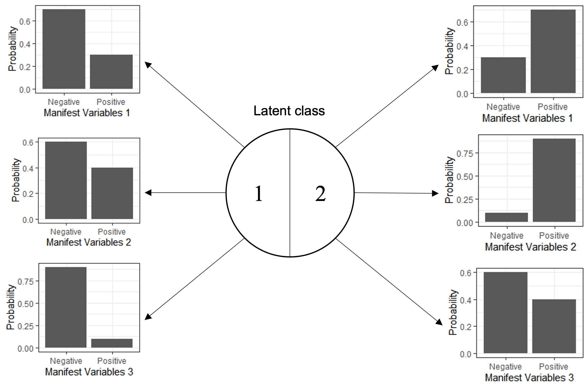

```{r setup, include=FALSE}
options(tinytex.engine_args = '-shell-escape')
knitr::opts_chunk$set(echo = FALSE, dpi=300) #, dev = 'png'
flextable::set_flextable_defaults(fonts_ignore=TRUE, font.size=9, table.layout='fixed')
```

```{r library, include=FALSE}
library(gtsummary)
library(dplyr)
library(magrittr, include.only = '%$%')
library(ggplot2)
library(patchwork)
library(officedown)

# All the misc functions go here.
my_fn <- new.env()

## Add labels accross a tbl
my_fn$add_labels <- \(.data, ...){
  cols <- list(...)
  for (i in seq_along(cols))
    attr(.data[[names(cols)[i]]], 'label') <- cols[[i]]
  .data
}

## Register a knit engine for stan code highlight
my_fn$stan_knitr_engine <- \(options){
  out <- c('\\begin{Shaded}','\\begin{minted}{stan}', options$code, '\\end{minted}','\\end{Shaded}')
  options$echo <- FALSE
  options$results <- "asis"
  knitr::engine_output(options, options$code, out)
}
knitr::knit_engines$set(stan_code = my_fn$stan_knitr_engine)

## Gist to number equations
## https://gist.github.com/mcanouil/eb75057432ff77846f4273d8808e615a
my_fn$is_docx_output <- function (fmt = knitr:::pandoc_to()) {
  if (length(fmt) == 0) {
    return(FALSE)
  } else {
    return(fmt == "docx")
  }
}

my_fn$numberEq.docx <- function (eq, lab, envir = docx.eqcounter) {
  assign(x = "counter", value = get(x = "counter", envir = envir)+1, envir = envir)
  assign(x = gsub("eq:", "", lab), value = get(x = "counter", envir = envir), envir = envir)
  lab <- get("counter", envir = envir)
  return(c('$$', eq, '\\;\\;\\;\\;(', lab, ')', '$$'))
}
my_fn$labEq.docx <- function (lab, envir = docx.eqcounter) {
  return(paste0('(', get(x = gsub("eq:", "", lab), envir = envir), ')'))
}

docx.eqcounter <- new.env()
docx.eqcounter$counter <- 0
  
# Register a knit engine for formula
my_fn$aligned_formula_knit <- \(options){
  out <- my_fn$numberEq.docx(options$code, lab = options$fml.lab)
  options$echo <- FALSE
  options$results <- "asis"
  knitr::engine_output(options, options$code, out)
}
knitr::knit_engines$set(aligned_formula = my_fn$aligned_formula_knit)

```

```{r data, include=FALSE}
data_dir <- '../../data/cleaned/'
load(file.path(data_dir, 'data_input.Rdata'))
data_dirty <- readRDS(file.path(data_dir, 'data_dirty.RDS'))
# data_19EI$csf_wbc=NULL
```

# Introduction

*Tuberculous meningitis (TBM)* is the most severe form of tuberculosis. Diagnosing TBM is notoriously challenging, with microbiological confirmation requiring identification of *Mycobacterium tuberculosis* in paucibacillary cerebrospinal fluid (CSF). In addition to widely used confirmatory methods of CSF testing for *M. tuberculosis* such as Ziehl-Neelsen (ZN) staining, GeneXpert MTB/RIF (Xpert), and Mycobacterial culture, additional parameters may increase the likelihood of a diagnosis of TBM. Such characteristics are illustrated in the uniform case definition for TBM [@marais2010] where, in the absence of positive microbiological tests, an increased certainty of TBM is assigned in the presence of particular clinical, CSF, and imaging findings, or with evidence of non-neurological *M. tuberculosis*.

In the absence of a gold standard for TBM diagnosis, the uniform case definition has been widely adopted, particularly for the evaluation of new index diagnostic tests. However, the uniform case definition was developed as a standardised approach to reporting TBM research, rather than a gold standard for TBM diagnosis. When categorising cases of suspected TBM, the uniform case definition allocates cases to one of four levels; *Definite*, *Probable*, *Possible*, and *Not TBM*, with both *Probable* and *Possible* each encompassing a numerical score range where higher scores increase the probability of a diagnosis of TBM. All *Probable* cases do not therefore have the same probability of having TBM. *Definite TBM* incorporates microbiological tests, which, in the case of mycobacterial culture, may not return a positive result for several weeks. The best combination of these 4 levels that represents TBM, whilst including no cases of *non-TBM*, is not known and probably lies beyond the use of 4 levels. True TBM cases are likely represented by all *Definite* cases, most *Probable* cases, and some *Possible* cases. 

Another risk may lay within the fact that scores are based on consensus where a mere change does need more time and efforts, its flexibility and adaptability to different settings is inferior to a statistical model, in which case several models can be made basing on one same dataset. *(in case this is ambiguous: this closely links to one of our objectives where we build a simplified score table that uses only clinical and demographic data, for resources-limited settings and quick screening)*

*Latent Class Analysis (LCA)* is a statistical technique which has been adopted in settings where a gold standard does not exist, in place of which are a set of mutually independent tests. This model assumes the whole population is separable into different unobserved classes; between them, the chance of positive test results are different. By combining information coming from the aforementioned tests -- or manifest variables -- we can recover prevalence of the hidden classes and the patients' true allocation. Figure \@ref(fig:classic-lca) exemplifies a situation where there are 3 manifest variables representing for two latent classes. The technique is commonly used in social science and psychology, but has been gradually adopted in several diagnostic and prognosis models, especially in Tuberculosis [@stout2018; @adams2019; @schumacher2016; @lahuerta-marin2018] given the limitation of current tools. Classical LCA imposes strong assumption of local independence, namely in each latent class, the distributions of all manifest variables are mutually independent, which might not hold in most cases hence hinders the applicability of such design. The introduction of random effects and Bayesian approach has brought more flexibility to the model [@qu1996; @toft2005; @menten2008].

```{r classic-lca, fig.cap = "Design of classic Latent Class Analysis with two unobserved classes 1 and 2 and three iid. binary manifest variables (1, 2, and 3). Distributions of manifest variables in both classes are generated for demonstration only", out.width='70%', fig.id = "classic-lca", , fig.cap.style = "Image Caption"}
# 
knitr::include_graphics("includes/classicLCA.png")
```

This analysis's main objective are to *(1)* re-estimate the latent performances, namely sensitivities and specificities, of current TBM confirmatory methods - ZN Smear, Xpert, and mycobacterial culture - against actual TBM status, taking into account the imperfection in current diagnosis; *(2)* make a re-adjustment to the the diagnosis scoring system, basing on statistical model, providing estimations of individual chance of having TBM.

As secondary objectives, our analysis also aim to build a simplified scoring system which only needs clinical and demographic information but has the capacity to approximate the full system's output - so that TBM risk can be calculated at admission. We also estimate a latent representation of individual bacillary burden given that they get TBM which may impact the tests results.

# Methods

## Population to analyse

Data used for this analysis were extracted from an observational study of brain infection conducted at the Hospital for Tropical Diseases (HTD), Ho Chi Minh City, Vietnam, a large centre providing secondary and tertiary treatment for a wide range of tropical infections [@thwaites2002]. Participants for this analysis were enrolled between 29th August 2017 and 22nd January 2021. Enrolled participants to the prospective observational study were at least 16 years old, with suspected brain infection, admitted to a neuro-infection ward, and undergoing lumbar puncture at baseline as a routine diagnostic procedure. Patients were ineligible for enrolment if performing a lumbar puncture was contraindicated, or if informed consent to join the study was not given (by the patient, or by a relative if the patient lacked capacity to consent). This study received ethical approvals from HTD and Oxford Tropical Research Ethics Committee [@donovan2020]. Specifically for the analysis, we also excluded patients with contaminated MGIT results and with no subsequent culture in the first week since admission.

## Data collection and testing procedures

Demographic data and relevant medical history were recorded. HIV testing was performed on a case-by-case basis by the treating clinician. However, all patients that were to enrol in a subsequent Tuberculous meningitis randomised controlled trial also conducted at HTD were tested for HIV. Patients with either a known HIV positive status, or a positive HIV test result, were considered HIV positive. Patients underwent clinical examination and laboratorial investigations according to main study protocol, including: blood test, sputum, and lumbar puncture, unless contra-indicated. CSF was obtained by lumbar puncture, with CSF white blood cells and cellular differential, CSF protein, CSF glucose (with paired blood glucose), and CSF lactate routinely measured. Optimally 6mls CSF was used for mycobacterial testing unless less CSF was available (in which case mycobacterial testing was still performed). Confirmatory tests for TBM performed on CSF and used for this analysis were Ziehl--Neelsen staining and smear (ZN Smear), mycobacterial culture using Mycobacteria Growth Indicator Tube (MGIT), and Xpert or Xpert MTB/RIF Ultra (XpertUltra). Given Xpert and XpertUltra were considered diagnostically comparable in a recent comparative study from this centre using a subgroup of these data [@donovan2020], Xpert and XpertUltra were considered the same in this analysis. Confirmatory mycobacterial testing was performed if TBM was suspected by the treating clinician.

Methods of CSF processing have been described elsewhere [@nhu2013, @donovan2020], however, briefly; CSF samples were centrifuged at 3000g for 15 minutes, and most of the CSF supernatant was removed. The CSF deposit was resuspended in 500µL of remaining supernatant, with this resuspended pellet then used for ZN smear (100µL), MGIT (200µL), and either Xpert or XpertUltra (200 µL).

All patients received appropriate anti-TB chemotherapy regimens according to national and local guidelines, depending on the diagnosis, without any interference from the study. At the time of discharge or death, all patients received a final diagnosis. If at least one of ZN Smear, Xpert, Xpert Ultra, or MGIT, was positive at any time during the follow-up, the patient would be considered confirmed TBM; otherwise, if TBM was clinically suspected and treated, with confirmatory microbiological tests negative, the patient would be considered suspected TBM. If the patient recovered without anti-TB chemotherapy they would be reassigned to another diagnosis (i.e. not TBM).

In the instance of repeat CSF sampling (performed based on clinical need), only the first samples with at least 3mls of collect CSF collected not later than the first week since admission were used. Results of haematological and biochemical parameters, and of ZN Smear, Xpert, Xpert Ultra, and MGIT, were taken from one same CSF samples (in addition to the paired blood glucose).

## Statistical Model

In the model, three aforementioned TBM confirmation tests (ZN Smear, MGIT, and Xpert) were used as manifest variables. Linear predictors for the latent class prevalence were *history and demographic information* (HIV status, Age, Past noticeable TB contact), *clinical signs and symptoms* (Days from onset to admission, Systemic symptoms suggestive of tuberculosis, Focal neurological deficit, Cranial nerve palsy, Glasgow Coma Score - GCS), *Imaging chest data* (Pulmonary TB, Miliary TB), *CSF criteria* (lymphocyte count, neutrophil count, oeosinophil count, erythrocyte count, glucose - with corresponding blood glucose, protein, lactate), and *Cryptococcus Antigen/Indian Ink* in combination.

### Data pre-processing

Most continuous variables were transformed to logarithmic scale and subsequently centred and scaled by their standard deviations. Glasgow Coma Score (GCS) and its components (Voice - GCSV, Eyes - GCSE, and Muscle - GCSM) were translated to *Reversed GCS* (RGCS = RGCSV + RGCSE + RGCSM) so that a $GCS = 15$ would be equivalent to $RGCS = 0$, while $GCS = 3$ would be translated to $RGCS = 12$ (table \@ref(tab:gcs-tab)).

```{r gcs-tab, out.width='100%', tab.id='gcs-tab', tab.cap='Conversion table from clasic Glasgow Coma Score (GCS) to Reversed GCS (RGCS)'}

tibble::tribble(
  ~ Feature,                     ~ Response, ~ GCS, ~ RGCS,
  'Eye response',        'Open sponatenously', 4, 0,
  'Eye response',     'Open to voice command', 3, 1,
  'Eye response',              'Open to pain', 2, 2,
  'Eye response',               'No eye open', 1, 3,
  'Verbal response',             'Orientated', 5, 0,
  'Verbal response',               'Confused', 4, 1,
  'Verbal response',     'Inappopriate words', 3, 2,
  'Verbal response','Incomprehensible sounds', 2, 3,
  'Verbal response',     'No verbal response', 1, 4,
  'Motor response',            'Obey command', 6, 0,
  'Motor response',         'Localising pain', 5, 1,
  'Motor response',    'Withdrawal from pain', 4, 2,
  'Motor response',                 'Flexing', 3, 3,
  'Motor response',               'Extending', 2, 4,
  'Motor response',       'No motor response', 1, 5
) |>
  flextable::flextable() |>
  flextable::merge_v(j = 1) |>  
  flextable::width(j=1, width=2) |>
  flextable::width(j=2, width=2)
# |>
  # flextable::theme_zebra()
```

Compared to the uniform case definition, we also made a change to **Past TB contact**, in which we hypothesise that by editing the original question into "Past noticeable contact with TB patients within the past recent year", we would be able to imply all "Unknown" answer as a "No". In the main study, no brain imaging was taken, hence not included.

Binary variables were dummy coded into 0 for "Negative"/"No" and 1 for "Positive"/"Yes".

### Latent class regression model

We created two-level model consisting of:

1.  *Prevalence model*: A logistic regression model estimating the prevalence of TBM amongst the study population
2.  *Latent class analysis*: estimating the probabilities of having positive results from three tests in each class. Similar to previous applications [@qu1996; @hadgu2002; @schumacher2016], we also corrected for individual bacillary burden and noise coming from the procedures themselves. *Latent bacillary burden* is regressed by a Gaussian random variable and fixed effects coming from relevant bio-markers. We hypothesised that amongst TBM-positive patients, those who have lower bacillary burden would be less likely to be tested positive.

```{r predictor-tab, out.width="100%",  tab.cap="Contribution of different variables in each model", tab.id = "predictor-tab", label='tab0'}
tibble::tribble(
  ~ 'Predictor'                    , ~ 'Risk of TBM', ~ 'Bacillary Burden',
  'Age'                            , '+'            , '0'                 ,
  'HIV Status'                     , '++'           , '+'                 ,
  'Past TB contact'                , '+'            , '0'                 ,
  'TB-suggested symptoms'          , '+'            , '0'                 ,
  'Local motor deficit'            , '+'            , '0'                 ,
  'Cranial nerve palsy'            , '+'            , '0'                 ,
  'Days from onset'                , '+'            , '0'                 ,
  'PTB/X-Ray'                      , '+'            , '0'                 ,
  'MTB/X-Ray'                      , '++'           , '0'                 ,
  'GCS'                            , '+'            , '0'                 ,
  'Cryptococcus Antigen/Indian Ink', '-'            , '0'                 ,
  'Blood Glucose'                  , '-'            , '0'                 ,
  'CSF Glucose'                    , '-'            , '?'                 ,
  'CSF Lymphocyte Count'           , '+'            , '?'                 ,
  'CSF Neutrophil Count'           , '+/-'          , '?'                 ,
  'CSF Protein'                    , '+'            , '?'                 ,
  'CSF Lactate'                    , '+'            , '?'                 ,
  'CSF Oeosinophil Count'          , '-'            , '0'                 ,
  'CSF RBC Count'                  , '-'            , '0'                 
) |>
  flextable::flextable() |>
  flextable::add_footer_row(values='"?" predictors were included in some models', colwidths = 3) |>
  flextable::add_footer_row(values='"0" predictors were not included in any model', colwidths = 3) |>
  flextable::add_footer_row(values='"++" predictors were strongly believed to be positive risk factors', colwidths=3) |>

  flextable::add_footer_row(values='"+", "+/-", and "-" reflects prior believes, but no difference was imposed in the model', colwidths=3) |>
  # flextable::merge_at(j = 1:3, part = "footer") |>
  # flextable::set_caption('Contribution of different variables in each model') |>
  flextable::width(j=1, width=2) |>
  flextable::width(j=2:3, width=1.2) |>
  flextable::theme_zebra() |>
  flextable::bold(bold = FALSE, part = "footer") |>
  flextable::italic(italic = TRUE, part = "footer" )
```

The inclusion of covariates was done according to prior knowledge of potential risk factors [@marais2010] that share association with the infection and test results, summarised in table \@ref(tab:predictor-tab)). CSF oeosinophil count was additionally included as it is a strong bio-marker for oeosinophilic meningitis, a condition usually caused by parasitic helminths. CSF erythrocyte count was added as an independent marker for traumatic lumbar puncture, in which case we also made correction to white cell counts and biochemical features, as suggested by [@greenberg2008; @nigrovic2011; @mehl1986].

```{dot skeleton-model, fig.show="hold", out.width="100%", out.height="5cm",  fig.align="center", fig.cap="Model skeleton. Bacillary Burden is only available in model 2+", fig.id="skeleton-model"}

digraph m1{
    rankdir = LR;
    compound = true;
    graph[dpi = 300, fontname="CMU Serif"];
    node[fontname = "CMU Serif"];

    subgraph cluster_pred{
        label = < <B>Predictors</B> >;
        bgcolor = lightgrey;
        node[style=filled fillcolor=white shape=rectangle];
        X1; X2; X3;
    }

    subgraph cluster_latent{
        rank=same;
        bgcolor = "#98cde2";
        label = < <B>Latent Space</B> >;
        node[shape=ellipse style=filled fillcolor=white];
        subgraph zzz{
            C[label=TBM];
            I[label="Bacillary burden" style="filled, dashed"];
            C -> I[label="+"];
        }
        
    }
    
    subgraph cluster_manifest{
        node[shape=box];
        label = < <B>Manifest variables</B> >;
        Y1[label="ZN Smear"];
        Y2[label="MGIT"];
        Y3[label="Xpert"];
    }

    {X1 X2 X3} -> C;
    C -> {Y2}[lhead="cluster_manifest"];
    X3 -> I -> Y3[lhead="cluster_manifest"];
}

```

```{dot dag-predictors, out.width="100%", out.height="100%", fig.cap="Directed acrylic graph of potential covariates", fig.id="dag-predictors", include=FALSE}
digraph {
    rankdir=TD;
    compound = true;
    graph[fontname="CMU Serif"];
    node[fontname = "CMU Serif"];

    subgraph cluster_clin{
      label = < <B>Clinical</B> >;
      bgcolor = lightgrey;
      node[style=filled fillcolor=white shape=rectangle];
      HIV[label = "HIV Status"];
      TBS[label = "TB Symptoms"];
      CP[label = "Cranial Palsy"];
      MP[label = "Motor Palsy"];
      PTB[label = "PTB/X-Ray"];
      MTB[label = "MTB/X-Ray"];
      Age;
      TBDay[label = "Illness duration"];
      GCS[label = "Glasgow Coma Score"]; 
      Crypto[label = "Cryptococcus Antigen"];
    }
    
    subgraph cluster_lab{
      label = < <B>Laboratory</B> >;
      bgcolor = lightgrey;
      node[style=filled fillcolor=white shape=rectangle];
      BldGlu[label = "Blood Glucose"];
      CsfGlu[label = "CSF Glucose"];
      CsfLym[label = "CSF Lymphocyte"];
      CsfNeu[label = "CSF Neurophil"];
      CsfPro[label = "CSF Protein"];
      CsfLac[label = "CSF Lactate"];
      CsfRBD[label = "CSF Red blood cell"];
      CsfEos[label = "CSF Eosinophil"];
    }

    subgraph cluster_latent{
        rank=same;
        bgcolor = "#98cde2";
        label = < <B>Latent Space</B> >;
        node[shape=ellipse style=filled fillcolor=white];
        subgraph zzz{
            C[label="TBM Status"];
            I[label="Bacillary Burden" style="filled, dashed"];
            C -> I[label = "TBM +"];
        }
    }

    CsfGlu -> C[ltail = cluster_lab];
    MP -> C[ltail = cluster_clin];
    {HIV} -> I;
    I -> {CsfGlu CsfLym CsfNeu CsfPro CsfLac}[dir=back];
}
```

Basic designs for all models is shown in figure \@ref(fig:skeleton-model). We use a stepwise approach where we incrementally added up more flexibility and lifted more constraints. We also include several extensions to explore many possibilities than can improve performance. In the main analysis, only CSF neutrophil count was model via a quadratic effect. A summary of all architectures an extensions are shown in table \@ref(tab:model-archs), whereas technical formulations are detailed in appendix \@ref(appendix-details).

```{r model-archs, tab.cap="Model architectures and extensions", tab.id="model-archs"}
model_archs <-
  data.frame(
    Model=1:5,
    Def=c(
      'No bacillary burden; everyone in the same class has equal risk of tested positive',
      'Added individual bacillary burden; impacts of bacillary burden on test results are the same',
      'Impacts of bacillary burden are different for different tests',
      'Added technical fluctuation as a second random effect; fixed effects only contributes to bacillary burden',
      'Added fixed effects for technical fluctuation'
    )
    #, 
    # PPCA=c('-', rep('For CSF biomarkers',4)), 
    #NLE=c('-',  rep('CSF Neutrophil count',4)), 
    #BB=c('-', rep('HIV status \n CSF Glucose \n CSF Lymphocyte count \n CSF Neutrophil count \n CSF Protein \n CSF Lactate',4))
  ) 

model_archs |> 
  flextable::flextable() |>
  flextable::set_header_labels(
    Model='Model', 
    Def='Base definition (compared to the lower one)'
    # PPCA='PPCA Extension',
    # NLE='Non-linear effects in Prevalence model',
    # BB='Covariates in bacillary burden'
  ) |>
  # flextable::set_caption('Model architectures and extensions') |>
  # flextable::footnote(i=4,j=2,value=flextable::as_paragraph('Technically, 2 random effects are combined as one'), part='body') |>
  flextable::width(j=1, width=.5)|>
  flextable::width(j=2, width=5) |>
  flextable::theme_zebra()
```

### Missing data handling

#### Manifest variables

By design, most patients with very high chance of and/or evidently diagnosed with different diseases were not tested with TBM confirmation assays (namely ZN Smear, MGIT, and Xpert), unless there were excessive amount of CSF samples. However, as confirmation tests' were all firmly believed to be almost specific [@nhu2013, @heemskerk2018], we assumed that patients who had no TBM confirmation tests are all negative. Apart from one premature death, all patients were tested or diagnosed with a different disease.

#### Predictors


In the analysis, most missingness were assumed to be Missing At Random (MAR) and imputed in one step within the main model, unless explicitly stated (table \@ref(tab:missing-handling)). Composite predictors such as *TB-suggested symptoms* and *Glasgow Coma Score (GCS)* were imputed by corresponding compartments; and potentially correlated variables were grouped and imputed together (as in *CSF biomakers*' case). Due to Stan not supporting Multivariate Logistic Distribution, in favour of methodological consistency, all binary predictors were imputed using (Multivariate) Probit models, which facilitate a (Multivariate) Normal Distribution instead [@albert1993]. Continuous predictors are imputed using Multivariate Linear Regression<!--# , with one exception of PPCA-extended models where the imputation of CSF bio-markers was handled by the PPCA directly -->.

As HIV tests were not mandatory in the main study, HIV status itself was also incomplete, but their chance of missingness were mostly dependent on whether or not the patients were to enrol in a TBM study. Hence, it is safely to assume that HIV status are also MAR. Accordingly, we imputed HIV using probit regression, with Blood Lymphocyte and Blood Neutrophil counts as donors.


In the case where missing values were imputed, figure \@ref(fig:impute-model) depicts how those were sampled, together with their potential donors. Note that due to technical limitation, imputed RGCS were treated as-is in the sampling step, but were rounded when estimating model performance.

```{dot impute-model, echo=FALSE, out.width="100%", out.height="100%", fig.align="center", fig.cap="Imputation strategy for predictors. Variables in rectangular solid boxes were used in the model, in oval dashed were only contributed in the imputation model as donors and were not directly included in the main model. Clustered covariables were imputed together in a multivariate regression. Arrows demonstrate a donor $\\rightarrow$ response correlation.", fig.id="impute-model"}

digraph imp_model{
  rankdir = TB;
  resolution=500;
  compound=true;
  graph[fontname="CMU Serif", concentrate=true];
  node[fontname = "CMU Serif"];
  edge[fontname = "CMU Serif"];
  
  subgraph cluster_clinsymp{
    rank=same;
    label = "TB-suggested symptoms";
    bgcolor = lightgrey;
    node[style="filled,dashed" fillcolor=white];
    Cough[label="Coughing"];
    subgraph lowerz{
      peripheries=0;
      Nsweats[label="Night Sweats"];
      WLoss[label="Weight Loss"];
    }
  }
  
  subgraph cluster_motor{
    rank=same;
    label = "Local motor deficit";
    bgcolor = lightgrey;
    node[style="filled,dashed" fillcolor=white];
    Hemi[label="Hemiplegia"];
    subgraph lowerz{
      peripheries=0;
      Para[label="Paraplegia"];
      Tetra[label="Tetraplegia"];
    }
  }
  
  subgraph cluster_gcs{
    label = "Reversed Glagow Coma Score";
    bgcolor = lightgrey;
    node[style="filled,dashed" fillcolor=white];
    RGCSV; RGCSM; RGCSE;
  }
  
  subgraph cluster_bld{
    # peripheries=0;
    bgcolor = lightgrey;
    rank=same;
    node[style="filled,dashed" fillcolor=white];
    subgraph zz{
      BldLymp[label="Blood Lymphocytes"];
      BldNeu[label="Blood Neutrophils"];
    }
  }
  
  subgraph cluster_csf{
    rank=same;
    bgcolor = lightgrey;
    node[style=filled fillcolor=white];
    subgraph glu{
      peripheries=0;
      CsfGlu;
      CsfLymp;
    }
    BldGlu;
    CsfNeu;
    subgraph bio{
      peripheries=0;
      CsfPro;
      CsfLac;
    }
  }
    
  HIV[label="HIV Status", shape="box"];
  Age[label="Age", shape="box"];
  TBDays[label="Illness days", shape="box"]; 
  BldGlu[label="Blood Glucose", shape="box"];
  CsfGlu[label="CSF Glucose", shape="box"]; 
  CsfLymp[label="CSF Lymphocytes", shape="box"];
  CsfNeu[label="CSF Neutrophils", shape="box"];
  CsfPro[label="CSF Protein", shape="box"];
  CsfLac[label="CSF Lactate", shape="box"];
  # GCS[label="Glasgow Coma Score", shape="box"];
  
  HIV -> {Age TBDays};
  HIV -> Hemi[lhead=cluster_motor];
  HIV -> Cough[lhead=cluster_clinsymp];
  BldNeu -> HIV;
  BldLymp -> HIV;
  
  BldLymp -> BldNeu[dir=both];
  
  TBDays -> Cough[lhead=cluster_clinsymp];
  TBDays -> Hemi[lhead=cluster_motor];
  
  Cough -> Nsweats[dir=both];
  Nsweats -> WLoss[dir=both];
  WLoss -> Cough[dir=both];
  Hemi -> Para[dir=both];
  Para -> Tetra[dir=both]; 
  Tetra -> Hemi[dir=both];
  CsfGlu -> BldGlu[dir=both];
  CsfGlu -> CsfLymp[dir=both];
  CsfLymp -> CsfNeu[dir=both];
  CsfNeu ->CsfPro[dir=both];
  CsfPro -> CsfLac[dir=both];
  BldGlu -> CsfLac[dir=both];

  RGCSV -> RGCSE[dir=both];
  RGCSE -> RGCSM[dir=both];
  RGCSM -> RGCSV[dir=both];
}  
```

### Prior choices

For imputation, $Normal(0,2.5)$ was chosen as prior distributions for all intercepts and coefficients [@prior-choice], except for RGCS (E, V, and M) as their supports were two-sided constained (section \@ref(data-pre-processing)) - in which case, suitable Uniform distributions were chosen for the means, and Normal for standard deviations (appendix \@ref(appendix-details)).

Cholesky decomposition of the covariance matrix was sampled from a *LKJ Correlation Cholesky* prior with $\eta = 4$ [@stan-doc].

```{r lkj, out.width='40%', out.height='4cm', fig.cap="Example density plot for $LKJCorrelationCholesky(\\eta=4)$ in bivariate case; 1 is perfect positive correlation, 0 is no correlation, and -1 is perfect negative correlation; black dot, thick, and thin line are the median, IQR and 95\\% credible interval", fig.align="center", fig.id="lkj"}

ggplot() + 
  ggdist::stat_dist_halfeye(aes(y = 0, dist = 'lkjcorr_marginal', arg1=2, arg2=4)) +
  xlab('Correlation') +
  ylab('') + 
  theme_minimal() +
  theme(text = element_text('serif', size = 9), 
        plot.tag = element_text('serif', size = 9),
        axis.text.y = element_blank(),
        axis.ticks.y = element_blank())
```

In LCA part, we imposed Student T with 4 degree of freedom ($t_4$) for intercept, in which we fixed scale to 5 as with belief that its norm would not be higher than 10 [@boonstra2019]. For coefficients, we use Normal distribution and multiplied sd by data standard variation for continuous variables, and 2 for binary variables, so that relatively similar penalisation was formed between them [@prior-choice, @vanerp2019, @gelman2007].

$$
\begin{aligned}
a_0 &\sim t_4(0, 5)\\
a_{binary} &\sim Normal(0, 2*s)\\
a_{continuous} &\sim Normal(0, sd * s)
\end{aligned}
$$
s.t: $s \sim Normal(0,\ 2.5)\ \&\ s>0$ and $sd$ = Standard Deviation of corresponding covariates after the imputation

<!-- -   Weakly informative prior: $t_4(0,\ s * sd)$ -->

<!-- -   Ridge-equivalent prior: $Normal(0,\ s * sd)$ -->

<!-- -   LASSO-equivalent prior: $DoubleExponential(0,\ s * sd)$ -->

For strongly positive risk factors (marked *++* in table \@ref(tab:predictor-tab)), priors were further left-truncated at 0. Individual random effects was sampled from $Normal(0,1)$ distribution.

```{aligned_formula, fml.lab='eq:priors_response', results='asis'}
\begin{aligned}
  1-Spc_{Xpert} &\sim Logistic(logit(0.005), .7) \\
  1-Spc_{MGIT}  &\sim Logistic(logit(0.001), 1) \\
  1-Spc_{ZN\ Smear} &\sim Logistic(logit(0.001), 1) \\ 
  Sen_{Xpert,\ MGIT,\ ZN\ Smear} &\sim Logistic(0,.5)
\end{aligned}
```

For manifest variables, our choices of prior are based on information collected from several previous studies involving Vietnamese cohort (@nhu2013, @thwaites2004, @heemskerk2018). A summarisation of these choices are shown in figure \@ref(fig:mv-priors)), on Logistic and Linear scale, and their relations to corresponding results derived from different studies. As suggested by the prior knowledge, we used highly informative priors for specificity (Spc) and weakly informative priors for sensitivity (Sen) on the logit scale (formula `r my_fn$labEq.docx('eq:priors_response')`), given the discrepancies between different research.

<!-- Estimated sensitivity and specificity of confirmation tests based on the uniform case definition [@marais2010] are listed in table @ref(tab:confirmation-test-tbl) [@nhu2013]. -->

```{r confirmation-test-tbl, eval=FALSE, include=FALSE, tab.cap="Prior knowledge of sensitvity and specifity for TBM confirmation tests", tab.id="confirmation-test-tbl"}
#placaholder
tibble::tribble(
  ~ Test,    ~ Specicity,         ~ Sensitivity,
  'ZN Smear', '100%'              , '78.6% (71.9%, 84.3%)',
  'MGIT'    , '100%'              , '66.5% (59.1%, 73.3%)',
  'Xpert'   , '99.5% (97.2 -100%)', '59.3% (51.8%, 66.5%)'
) |>
  flextable::flextable() |>
  # flextable::set_caption('Prior knowledge of sensitvity and specifity for TBM confirmation tests.') |>
  flextable::add_footer(Test = 'Numbers are in format of estimated (95% Confidence Interval)') |>
  flextable::merge_at(j = 1:3, part='footer') |>
  flextable::width(width=2) |>
  flextable::theme_zebra()
```

```{r mv-priors, fig.cap="Density plots for prior distributions and their adherence to prior knowledge of sensitvity and specifity for TBM confirmation tests, against then-made clinical diagnosis. Note that Thwaites 2004 was descriptive only while ZN and Culture in Nhu 2013 were references hence no Confidence Interval", warning=FALSE,  fig.align='center', out.width='90%', fig.id="mv-priors", fig.height=8, dpi=300 }
sen_tbl <-
  tibble::tibble(
    'Test' = rep(c('ZN', 'Culture', 'Xpert'), 3),
    'Study' = rep(c('Thwaites 2004', 'Nhu 2013', 'Heemskerk 2018'), each=3),
    'est' = c(58/100, 64/100, NA, 78.64/100, 66.54/100, 59.34/100, 34.54/100, 31.84/100, 25.14/100),
    'lower.ci' = c(NA, NA, NA, 71.94/100, 59.14/100, 51.84/100, 29.94/100, 27.34/100, 21.04/100),
    'upper.ci' = c(NA, NA, NA, 84.34/100, 73.34/100, 66.54/100, 39.44/100, 36.74/100, 29.74/100)
  )

spc_tbl <-
  tibble::tibble(
    'Test' = rep(c('ZN', 'Culture', 'Xpert'), 3),
    # Test_id = rep(c(3,1,2), 2),
    'Study' = rep(c('Thwaites 2004','Nhu 2013', 'Heemskerk 2018'), each=3),
    'est' = c(NA, NA, NA, 0, 0, 0.05/100, 0, 0, 0),
    'upper.ci' = c(NA, NA, NA, NA, NA, (100-97.2)/100, (100-97.1)/100, (100-96.9)/100, (100-96.1)/100),
    'lower.ci' = c(NA, NA, NA, NA, NA, 0, 0, 0, 0)
  )

spc_rng = rbind(
  data.frame(
    Test = 'ZN',
    Test_id = 1,
    logit = rlogis(500000,qlogis(.001),1),
    linear = rlogis(500000,qlogis(.001),1) |> plogis()
  ),
  data.frame(
    Test = 'Culture',
    Test_id = 2,
    logit = rlogis(500000,qlogis(.001),1),
    linear = rlogis(500000,qlogis(.001),1) |> plogis()
  ),
  data.frame(
    Test = 'Xpert',
    Test_id = 3,
    logit = rlogis(500000,qlogis(.005),.7),
    linear = rlogis(500000,qlogis(.005),.7) |> plogis()
  )
) 
  # |> 
  # tidyr::pivot_longer(cols=c(logit, linear), names_to = 'scale.name', values_to = 'scale.value')

sen_rng = rbind(
  data.frame(
    Test = 'ZN',
    Test_id = 1,
    logit = rlogis(500000, 0,.3),
    linear = rlogis(500000, 0,.3) |> plogis()
  ),
  data.frame(
    Test = 'Culture',
    Test_id = 2,
     logit = rlogis(500000, 0,.3),
    linear = rlogis(500000, 0,.3) |> plogis()
  ),
  data.frame(
    Test = 'Xpert',
    Test_id = 3,
    logit = rlogis(500000, 0,.3),
    linear = rlogis(500000, 0,.3) |> plogis()
  )
) 

spc_linear_plt <- ggplot() + 
  ggdist::stat_halfeye(mapping=aes(y=linear), data=spc_rng) +
  geom_point(aes(y= est, color = Study, x = -.2), data=spc_tbl, position=position_dodge(.2), shape=18, size=3) + 
  geom_linerange(aes(ymin = lower.ci, ymax = upper.ci, color = Study, x = -.2), data=spc_tbl, position=position_dodge(.2)) +
  coord_flip(ylim=c(0,.07))+
  facet_grid(Test~.)+
  xlab('') + ylab('') +
  scale_color_discrete(drop=FALSE)+
  theme_minimal() +
  theme(text = element_text('serif', size = 9), 
        plot.tag = element_text('serif', size = 9),
        axis.text.y = element_blank(),
        axis.ticks.y = element_blank())

spc_logit_plt <- ggplot() + 
  ggdist::stat_halfeye(mapping=aes(y=logit), data=spc_rng) +
  facet_grid(Test~.)+
  xlab('') + ylab('') +
  coord_flip() +
  theme_minimal() +
  theme(text = element_text('serif', size = 9), 
        plot.tag = element_text('serif', size = 9),
        axis.text.y = element_blank(),
        axis.ticks.y = element_blank())

sen_linear_plt <- ggplot() + 
  ggdist::stat_halfeye(mapping=aes(y=linear), data=sen_rng) +
  geom_point(aes(y= est, color = Study, x = -.2), data=sen_tbl, position=position_dodge(.2), shape=18, size=3) + 
  geom_linerange(aes(ymin = lower.ci, ymax = upper.ci, color = Study, x = -.2), data=sen_tbl, position=position_dodge(.2)) +
  coord_flip()+
  facet_grid(Test~.)+
  xlab('') + ylab('') +
  theme_minimal() +
  theme(text = element_text('serif', size = 9), 
        plot.tag = element_text('serif', size = 9),
        axis.text.y = element_blank(),
        axis.ticks.y = element_blank())

sen_logit_plt <- ggplot() + 
  ggdist::stat_halfeye(mapping=aes(y=logit), data=sen_rng) +
  facet_grid(Test~.)+
  xlab('') + ylab('') +
  coord_flip() +
  theme_minimal() +
  theme(text = element_text('serif', size = 9), 
        plot.tag = element_text('serif', size = 9),
        axis.text.y = element_blank(),
        axis.ticks.y = element_blank())
  

plt <- (spc_linear_plt + ggtitle('FPR (1-Specificity)') + theme(legend.position = "none") | spc_logit_plt) /
  (sen_linear_plt + ggtitle('TPR (Sensitivity)') + theme(legend.position = "bottom") | sen_logit_plt) 

for (i in 1:2) plt[[i]] <- plt[[i]] + plot_layout(tag_level = 'new')
color_me <- list("#000000", "#E69F00", "#56B4E9", c("#000000", "#E69F00", "#56B4E9", "#009E73"))
withr::with_options(
  list(ggplot2.discrete.colour = color_me),

  plt + plot_annotation(tag_levels = list(c('',''), 'A'), caption='A: Linear scale, B: Logistic Scale \n Black dots, thick lines and thin lines are median, IQR, and 95% credible intervals of our priors') + plot_layout(guides = 'collect') & theme(text = element_text('serif', size = 9), plot.tag = element_text('serif', size = 9), legend.position = "bottom") 
)
```

```{r mv-priors-old-unused, eval=FALSE, fig.align="center", fig.cap="Density plots for different priors. A: Logistic(logit(.005),.7), warning=FALSE, B: Logistic(logit(.001),.3), C: Logistic(0,.5). 1: Logit scale, 2: Linear scale.", fig.id="mv-priors", include=FALSE, out.height='10cm', out.width='100%'}

pl.7_logistic <- ggplot() + ggdist::stat_halfeye(aes(x=rlogis(100000,qlogis(.005),.7)))+
  xlab('') + ylab('') +
  theme_minimal() +
  theme(text = element_text('serif', size = 9), 
        plot.tag = element_text('serif', size = 9))

pl.7_linear <- ggplot() + ggdist::stat_halfeye(aes(x=rlogis(200000,qlogis(.005),.7) |> plogis())) + 
  xlab('') + ylab('') +
  # xlim(0, 0.05) +
  coord_cartesian(xlim=c(0,.05)) +
  theme_minimal() +
  theme(text = element_text('serif', size = 9), 
        plot.tag = element_text('serif', size = 9))

pl.3_logistic <- ggplot() + ggdist::stat_halfeye(aes(x=rlogis(200000,qlogis(.001),.3))) +
  xlab('') + ylab('') +
  theme_minimal() +
  theme(text = element_text('serif', size = 9), 
        plot.tag = element_text('serif', size = 9))

pl.3_linear <- ggplot() + ggdist::stat_halfeye(aes(x=rlogis(200000,qlogis(.001),.3) |> plogis())) +
  xlab('') + ylab('') +
  coord_cartesian(xlim=c(0,.05)) +
  theme_minimal() +
  theme(text = element_text('serif', size = 9), 
        plot.tag = element_text('serif', size = 9))

pl.5_logistic <- ggplot() + ggdist::stat_halfeye(aes(x=rlogis(500000, 0,.5))) +
  xlab('') + ylab('') +
  theme_minimal() +
  theme(text = element_text('serif', size = 9), 
        plot.tag = element_text('serif', size = 9))

pl.5_linear <- ggplot() + ggdist::stat_halfeye(aes(x=rlogis(200000,0,.5) |> plogis())) +
  xlab('') + ylab('') +
  theme_minimal() +
  theme(text = element_text('serif', size = 9), 
        plot.tag = element_text('serif', size = 9))

pl <- (pl.7_logistic + pl.7_linear) /
      (pl.3_logistic + pl.3_linear) /
      (pl.5_logistic + pl.5_linear)

for (i in 1:3) pl[[i]] <- pl[[i]] + plot_layout(tag_level = 'new')

pl + plot_annotation(tag_levels=c('A', 1), tag_prefix = 'Fig.', tag_suffix=':', caption = 'Black dots, thick lines and thin lines are median, IQR, and 95% credible intervals')
```

### Model performances

Models performances were estimated and compared by three metrics:

-   Expected log point-wise predictive density (*elpd*) of held-out observations: Models with higher *elpd* are supposed to have more predictive values for untrained observations [@vehtari2016].

-   Visualised model calibration between estimated predicted and observed probabilities of positive confirmation tests, using a non-parametric loess fit [@rms]. A model with good calibration would predict the risk equivalent to observation.

-   Receiver Operating Characteristic (ROC) curve and corresponding Areas Under the Curve (AUC) . Confidence interval for AUC was estimated by a 2000-time bootstrapped samples. A model with good discriminative value would be better to distinguish between two class.

For a good insight, we also visualised class-wise predicted probability density plots to visualise how much separable the classes are based on the models. This demonstrates how separated predicted values are between two classes. We also used the diagnosis at discharge as a pseudo-gold standard to visualise the correlation of model-based and clinical diagnosis.

All metrics are combined from 5 repetitions of 20-fold cross validated datasets (i.e. 100 fits, as suggested by [@rms]). Accordingly, we selected three best-performed models and re-estimated their parameters using the full dataset.

We also test for local independence assumption. <!--# clarification needed -->.

### Exploratory and sensitivity analysis

#### Complete-case analysis and imputation under MNAR assumption

To check the level of impact from our imputation method, we did a complete-case analysis. Suspected MNAR variables as listed in table \@ref(tab:missing-handling) were also tested for MNAR where we randomly allocated values based on experts' opinions. Under MNAR assumption, we did a pattern-mixture method [@mason2017; @white2007], where we inquired prediction offsets $\delta$. $\delta$ represents the difference between unobserved part and observed part of each variables, after correction for all hyper-predictors listed in \@ref(fig:impute-model). Offsets were collected from interviews with experts working at the Viet Anh Ward at HTD, where they were supposed to provide an estimation and 95% confidence intervals (95% CI), based on which $\delta$s were then sampled from.

$$
\delta \sim Normal(\mu_{expert}, sd_{expert})
$$*where* $\mu_{expert}$ *and* $sd_{xpert}$ *are estimation and* $\frac{1}{2}$ *of 95% CI provided by interviewed experts*.

The main model underwent a relief of strict priors for test specificities in formula `r my_fn$labEq.docx('eq:priors_response')`, the lifted model used the same prior for all three tests which cover specificity from at least 90%:

$$
1-Spc_{lifted} \sim Logistic(\mu, 1)

$$ *where* $\mu = logit(0.001)$ for ZN Smear and MGIT, $\mu = logit(0.005)$ for Xpert.

Lastly, as recent studies suggested a sup-optimal specificity of Xpert test on CSF samples[@nhu2013; @chen2020], our assumptions made in table \@ref(tab:missing-handling) might not completely valid. To tackle this, we considered a MAR scenario, where observation chance of confirmation tests depend on the unknown TBM status and locally independent to the value of confirmation tests. The observation status was then included in the model as a separated manifest variables. The validity of this method was depicted in a simulation study in \@ref(appendix-simulation-study).

In this analysis, we expected the chance in which at least one confirmation test was done are 95% for TBM-positive patients, and 50% for TBM-negative, hence led to two conservative priors:

$$
\begin{aligned}
obs_{TBM-} &\sim Logistic(logit(.5), .7) \\
obs_{TBM+} &\sim Logistic(logit(.95), 1)
\end{aligned}
$$

```{r liftes-priors, out.width='90%', out.height='8cm', fig.width=7, fig.asp=.3, fig.align='center', fig.cap='Lifted prior for ZN Smear and MGIT specificities, compared to the old one (dark grey). 1: logit scale, 2: linear scale', warning=FALSE}
pl.7.1_logistic <- ggplot() + ggdist::stat_halfeye(aes(x=rlogis(200000,qlogis(.001),.7)))+
  ggdist::stat_halfeye(aes(x=rlogis(200000,qlogis(.001),.3)), fill=grey(.3))+
  xlab('') + ylab('') +
  theme_minimal() +
  theme(text = element_text('serif', size = 9), 
        plot.tag = element_text('serif', size = 9))

pl.7.1_linear <- ggplot() + ggdist::stat_halfeye(aes(x=rlogis(200000,qlogis(.001),.7) |> plogis())) + 
  ggdist::stat_halfeye(aes(x=rlogis(200000,qlogis(.001),.3) |> plogis()), fill=grey(.3))+
  xlab('') + ylab('') +
  coord_cartesian(xlim=c(0, .05)) + 
  # xlim(0, 0.05) +
  theme_minimal() +
  theme(text = element_text('serif', size = 9), 
        plot.tag = element_text('serif', size = 9))

pl2 <- pl.7.1_logistic + pl.7.1_linear

pl2 + plot_annotation(tag_levels=1, tag_prefix = 'Fig.', tag_suffix=':', caption = 'Black dots, thick lines and thin lines are median, IQR, and 95% credible intervals') & theme(text = element_text('serif', size = 9), plot.tag = element_text('serif', size = 9))
```

#### Prior families

Considering our prior family might have affected the estimation, we also consider different families of priors for coefficients in the best model. Scales were automatically selected and adjusted using the same technique mentioned in \@ref(prior-choices)..

-   Weakly informative prior: $t_4(0,\ s * sd)$

-   LASSO-equivalent prior: $DoubleExponential(0,\ s * sd)$

s.t: $s \sim Normal(0,\ 2.5)\ \&\ s>0$ and $sd$ = Standard Deviation of corresponding covariates after the imputation

#### Non-linearity and additional features

As part of the exploratory analysis, we considered two models:

- Non-linearity for all CSF bio-markers: We added quadratic effects for all CSF bio-markers in the prevalence model. LASSO-based variable selection was implemented for this analysis.

- Non-linearity for Glasgow coma scores: As GCS is not a continuous variable but rather an ordinal one de facto, it is possible that there is non-linear correlation between GCS and TBM risk. In this analysis, we employed a quadratic effect for GCS to capture this potential of non-linearity.

<!-- -   Probabilistic Principal Component Analysis (PPCA): Instead of performing Variable selection, we performed an implementation of Probabilistic Principal Component Analysis for dimensionality reduction, especially amongst potentially collinear predictors. In this analysis, we only implemented this for collinearity-prone CSF bio-markers. -->

- Impact of CSF volume: By including the volume of sample collected, we can further investigate the effect size of CSF volumes on the sensitivity of each confirmation test.

### Simplified approximation of TBM risk

As the full model requires a plethora of predictors and measurements, it might not be pragmatic in some limited contexts. We hence developed a simplified version of the prevalence sub-model which exclude all laboratorial features. The aim of this exploratory analysis is to provide a decent approximation of TBM risk yet needs only a minimal amount of information. We took out the analytic forms of posterior distributions from the best-performed model, on the logit scale, fed them into subsequent model where the number of predictors were reduced. The error term follows Logistic distribution with $scale = 1$.

$$
z_{approx} \sim Logistic(z, 1);
$$

*s.t.* $z$ is the full model's output and $z_{approx}$ is an approximation of $z$.

All data preparation, cleaning, and processing were performed on statistical package R, version 4.1.0 [@rcoreteam]. The model was developed on the probabilistic language Stan via the interface Rstan , version 2.27 [@stan]. Plotting was done using package bayesplot [@bayesplot], classifierplots [@classifierplots], and ggvenn [@ggvenn]. Some other packages used include: R6 [@r6], rms [@rms].

# Results

Venn diagram for confirmation test results are demonstrated in \@ref(fig:venn-test)

```{r venn-test, out.width='60%', fig.align='center', fig.asp=1, fig.cap = 'Venn diagram for ZN Smear, MGIT, and Xpert'}

data_19EI |>
  mutate(across(c(csf_smear, csf_mgit, csf_xpert), as.logical)) |>
  ggplot() +
  ggvenn::geom_venn(aes(A = csf_smear, B = csf_mgit, C = csf_xpert), 
                    fill_color = c('#E5707E', '#E6B566', '#A3DDCB'),
                    stroke_color = c('#E5707E', '#E6B566', '#A3DDCB'),
                    set_names = c('ZN Smear', 'MGIT', 'Xpert'),
                    text_size = 3, set_name_size = 4) +
  theme_void()

```

```{r missing-handling, tab.cap="Rationales and measures to handle missing values", tab.id="missing-handling"}
na = \(x) sum(is.na(x))
data_dirty$csf_neutro <- data_dirty$NEUPER * data_dirty$csf_wbc / 100
data_dirty %$%
  tibble::tribble(
     ~ 'Variable'           , ~ 'N\n missing'     ,  ~ 'Expected Reason of Missingness'                      , ~ 'Mechanism',        ~ 'Handling method' ,
    'ZN Smear'              , na(csf_smear)       , 'Not suspected TBM'                                      , 'MNAR'               , 'Set = 0'          , 
    'MGIT'                  , na(csf_mgit)        , 'Not suspected TBM'                                      , 'MNAR'               , 'Set = 0'          , 
    'Xpert'                 , na(csf_xpert)       , 'Not suspected TBM'                                      , 'MNAR'               , 'Set = 0'          , 
    'HIV Status'            , na(hiv_stat)        , 'Test not mandatory'                                     , 'MAR/MCAR'           , 'Imputation'       ,
    'TB-suggested symptoms' , na(clin_symptoms)   , 'Unmeasured / Unnoticed / Unconscious'                   , 'MAR/MNAR'           , 'Imputation'       ,
    'Local neuro-deficit'   , na(clin_motor_palsy), 'Unconscious'                                            , 'MAR/MNAR'           , 'Imputation'       ,
    'Glasgow Coma Score'    , na(clin_gcs)        , 'Unconscious (GCSV) / Blinded (GCSE) / Unmeasured'       , 'MAR'                , 'Imputation'       ,
    'Age'                   , na(age)             , 'Input error'                                            , 'MCAR'              , 'Imputation'       ,
    'Illness days'          , na(clin_illness_day), 'Patients forget / Unconscious'                          , 'MAR'                , 'Imputation'       ,
    'Blood Lymphocyte'      , na(LYMP)            , 'Unmeasured (premature death)'                           , 'MAR'                , 'Imputation'       ,
    'Blood Neutrophil'      , na(NEUTRO)          , 'Unmeasured (premature death)'                           , 'MAR'                , 'Imputation'       ,
    'Blood Glucose'         , na(BLDGLU)          , 'Most likely input error / Unmeasured (premature death)', 'MAR/MCAR'           , 'Imputation'       ,
    'CSF glucose'           , na(csf_glucose)     , 'Unmeasured (premature death)'                           , 'MAR/MCAR'           , 'Imputation'       ,
    'CSF lymphocyte count'  , na(csf_lympho)      , 'Very low or zero / Input error / Unmeasured (premature death)', 'MNAR/MAR'           , 'Manually set/Imputation',
    'CSF neutrophil count'  , na(csf_neutro)      , 'Very low or zero / Input error / Unmeasured (premature death)', 'MNAR/MAR'           , 'Manually set/Imputation',
    'CSF protein'           , na(csf_protein)     , 'Data input error / Unmeasured (premature death)'       , 'MAR/MCAR'           , 'Imputation'       ,
    'CSF lactate'           , na(csf_lactate)     , 'Unmeasured (premature death)'                              , 'MAR/MCAR'           , 'Imputation'     
    # 'CSF RBC count'         , na(csf_rbc)         , 'Zero cell count'                                        , 'MNAR'               , 'Set = 0'                  
  ) |>
  flextable::flextable() |>
  # flextable::set_caption('Rationale and method of missing values handling') |>
  flextable::width(width = 1.25) |>
  flextable::footnote(i = c(14,15),j = 1,inline=FALSE,
                      value=flextable::as_paragraph(rep('CSF Cell counts = CSF white-cell count x Pct of Cell Type / 100; if very low, then either lymphocytes or neutrophils had values, the other were left missing')),
                      part = 'body') |>
  flextable::merge_v(part='footer') |>
  flextable::theme_zebra() |>
  flextable::bold(bold=FALSE, part='footer') |>
  flextable::italic(italic=TRUE, part='footer')
```

\newpage

\blandscape

<!---BLOCK_LANDSCAPE_START--->

```{r test-bl-tbl, echo=FALSE}
bl_tbl <- 
  data_19EI |>
  as_tibble() |>
  mutate(csf_neutro = csf_wbc - csf_lympho - csf_eos) |>
  mutate(
    across(c(csf_smear, csf_xpert, csf_mgit), 
           ~ factor(.x, 
                    levels = c(0,1), 
                    labels = c('Negative', 'Positive')
           )
    )
  ) |>
  select(age, hiv_stat, diabetes = ISDIABETE, clin_illness_day, clin_symptoms, clin_contact_tb, clin_motor_palsy, clin_nerve_palsy, clin_gcs, xray_pul_tb, xray_miliary_tb, csf_lympho, csf_neutro, csf_eos, csf_rbc, csf_protein, csf_lactate, csf_glucose, bld_glucose = BLDGLU, csf_crypto, csf_smear, csf_xpert, csf_mgit) |>
  tidyr::pivot_longer(
    c(csf_smear, csf_mgit, csf_xpert),
    names_to = 'Test',
    values_to = 'Result'
  ) |>
  my_fn$add_labels(
    age               = 'Age',
    hiv_stat          = 'HIV Positive', 
    diabetes          = 'Diabetes',
    clin_illness_day  = 'Day from onset',
    clin_symptoms     = 'TB-suggested symptoms',
    clin_contact_tb   = 'Past noticeable contact TB within 12 months',
    clin_motor_palsy  = 'Focal neurological deficit',
    clin_nerve_palsy  = 'Crain nerve palsy',
    clin_gcs          = 'Glasgow Coma Score',
    xray_pul_tb       = 'X-Ray Pulmonary TB',
    xray_miliary_tb   = 'X-Ray Miliary TB',
    csf_lympho        = 'CSF Lymphocyte Count',
    csf_neutro        = 'CSF Neutrophil Count',
    csf_eos           = 'CSF Oeosinophil Count',
    csf_rbc           = 'CSF Red blood cell Count',
    csf_protein       = 'CSF Protein',
    csf_lactate       = 'CSF Lactate',
    csf_glucose       = 'CSF Glucose',
    bld_glucose       = 'Corresponding Blood Glucose',
    csf_crypto        = 'Cryptococcal Antigen/Indian Ink'
  ) |>
  mutate(
    Test = case_when(
      Test == 'csf_smear' ~ 'ZN Smear',
      Test == 'csf_mgit'  ~ 'MGIT',
      Test == 'csf_xpert' ~ 'Xpert (Ultra) MTB/RIF',
    )
  ) |>
  tbl_strata(
    strata = Test,
    .tbl_fun = ~ tbl_summary(
      .x, 
      by = Result,
      missing_text = '  - Missing',
      statistic = list(all_continuous() ~ '{mean} ({p25}, {p75})'),
      digits = list(csf_eos ~ c(0, 0, 0), clin_gcs ~ c(0, 0, 0))
    )
  ) |>
  modify_footnote(
    update = all_stat_cols() ~ "Mean (1st, 3rd quartiles) for numeric variables; n (%) for for categorical variables",
    text_interpret = "html"
  )

bl_tbl |> as_flex_table() |>
  flextable::set_caption('History and baseline information') |>
  flextable::width(width = 1.25) |>
  flextable::fontsize(size=10, part = 'all') |>
  flextable::theme_zebra()

```

<!---BLOCK_LANDSCAPE_STOP--->

\elandscape

\newpage

# Discussion

# Conclusion

# References

::: {#refs}
:::

# (APPENDIX) Appendix {.unnumbered}

# Model Specification Details {#appendix-details}

## Latent Class Model

For $1 \leq i \leq 678$, {$C \in {0,1}$, $\theta_i$} is the *latent class* and *individual risk of TBM*; $y^{Smear}_i$, $y^{Mgit}_i$, and $y^{Xpert}_i$} are the *observed value* for ZN Smear, Culturing, and Xpert, respectively. The marginal joint distribution of observations is as follow:

```{aligned_formula, fml.lab='eq:lca-fml', results='asis'}
\begin{aligned}
P_i = P(y^{Smear}_i,y^{Mgit}_i,y^{Xpert}_i) &= \theta_i * P(y^{Smear}_i,y^{Mgit}_i,y^{Xpert}_i|C=1)\\ 
&\ \ \ \ + (1-\theta_i) * P(y^{Smear}_i,y^{Mgit}_i,y^{Xpert}_i|C=0) \\
&= \theta_i * P(y^{Smear}_i | C=1) * P(y^{Mgit}_i | C=1) * P(y^{Xpert}_i | C=1) \\
&\ \ \ \ + (1-\theta_i) *  P(y^{Smear}_i | C=0) * P(y^{Mgit}_i | C=0) * P(y^{Xpert}_i | C=0)
\end{aligned} 
```

Under the assumption of local independence (model 0 and 1), the probabilities of positive test within class only depend on the latent class itself, thus $P(y^{Smear}_i, y^{Mgit}_i, y^{Xpert}_i|C = c) = P(y^{Smear}_j, y^{Mgit}_j, y^{Xpert}_j|C = c) = const$ for $c \in {0, 1}$.

For model and 2 and 3, we hypothesised that in the TBM positive class (C=1), test results are additionally dependent and only dependent on latent bacillary burden as in [@schumacher2016], shared between the three tests and in turn regressed on a set of covariables (denoted as $X^{(t)}_i$) using a mixed-effect logistic regression so that formula `r my_fn$labEq.docx('eq:lca-fml')` becomes:


```{aligned_formula, fml.lab='eq:lca-fml', results='asis'}
\begin{aligned}
P_i = P(y^{Smear}_i,y^{Mgit}_i,y^{Xpert}_i) &= \theta_i * P(y^{Smear}_i,y^{Mgit}_i,y^{Xpert}_i|C=1, X^{(t)}_i)\\ 
&\ \ \ \ + (1-\theta_i) * P(y^{Smear}_i,y^{Mgit}_i,y^{Xpert}_i|C=0) \\
&= \theta_i * P(y^{Smear}_i | C=1,X^{(t)}_i) * P(y^{Mgit}_i | C=1,X^{(t)}_i * P(y^{Xpert}_i | C=1, X^{(t)}_i \\
&\ \ \ \ + (1-\theta_i) *  P(y^{Smear}_i | C=0) * P(y^{Mgit}_i | C=0) * P(y^{Xpert}_i | C=0)
\end{aligned} 
```

s.t.

```{aligned_formula, fml.lab='eq:bd', results='asis'}
\begin{aligned}
logit(P^Y_i) &= z^Y_0 + BD_i * b_{BD} \\
&= z^Y_0 + (X^{(t)}_i)^T * B + RE_i * b_{BD}
\end{aligned} 
```

where $Y=Smear|Mgit|Xpert$ $z_0$ is the intercept, $b_BD$ is the coefficient of bacillary burden on test results, $B$ is the vector of coefficients, and $RE$ is the individual random effect.  

In model 4, we additionally captured the sample-wise fluctuation that cannot be explained by the bacillary burden alone. This fluctuation is regressed by one extra random effect not shared between tests. For numerical stability, we combined the random effect in `r my_fn$labEq.docx('eq:bd')` with this, so that:

```{aligned_formula, fml.lab='eq:bd2', results='asis'}
\begin{aligned}
logit(P(y^{Smear}_i)) &= z^{Smear}_0 + BD_i * b_{BD} + RE2^{Smear}_i * b_{RE2}\\
&= z^{Smear}_0 + ((X^{(t)}_i)^T * B + RE_i) * b_{BD} + RE2^{Smear}_i * b_{RE2} \\
&= z^{Smear}_0 + ((X^{(t)}_i)^T * B) * b_{BD} + RE^{Smear}_i * b_{RE} \\
logit(P(y^{Mgit}_i)) &= z^{Mgit}_0 + BD_i * b_{BD} + RE2^{Mgit}_i * b_{RE2}\\
&= z^{Mgit}_0 + ((X^{(t)}_i)^T * B + RE_i) * b_{BD} + RE2^{Mgit}_i * b_{RE2} \\
&= z^{Mgit}_0 + ((X^{(t)}_i)^T * B) * b_{BD} + RE^{Mgit}_i * b_{RE} \\
logit(P(y^{Xpert}_i)) &= z^{Xpert}_0 + BD_i * b_{BD} + RE2^{Xpert}_i * b_{RE2}\\
&= z^{Xpert}_0 + ((X^{(t)}_i)^T * B + RE_i) * b_{BD} + RE2^{Xpert}_i * b_{RE2}\\
&= z^{Xpert}_0 + ((X^{(t)}_i)^T * B) * b_{BD} + RE^{Xpert}_i * b_{RE}
\end{aligned} 
```

Lastly, for model 5, as an exploratory model, we explored all potential impacts of $X_t$ on the sample level.

```{aligned_formula, fml.lab='eq:bd3', results='asis'}
\begin{aligned}
logit(P(y^{Smear}_i)) &= z^{Smear}_0 + X^{(t)}_i)^T * B + RE^{Smear}_i * b_{RE} \\
logit(P(y^{Mgit}_i)) &= z^{Mgit}_0 + X^{(t)}_i)^T * B + RE^{Mgit}_i * b_{RE} \\
logit(P(y^{Xpert}_i)) &= z^{Xpert}_0 + X^{(t)}_i)^T * B + RE^{Xpert}_i * b_{RE}
\end{aligned} 
```

$\theta$ was a linear combination of potential predictors, which implies a logistic regression for latent binary outcome.

```{aligned_formula, fml.lab='eq:theta'}
logit(\theta) = a_0 + X^T A
```
*where X and A are vector of covariates and coefficients.*

$StudentT$ with $df=4$ was used as a prior for $a_0$ as we believed that the intercept is bounded by $[-10,10]$. Let $A = [a_1,...a_M]^T$ in which M is the number of covariates:

$$
\begin{aligned}
a_0 &\sim t_4(0, 6)\\
a_i &\sim Dist(0, sd_1)
\end{aligned}
$$
*where $sd_1$ is the penalised scale and $Dist$ one of is $Normal$, $DoubleExponential$, or $StudentT_4$.

RE was imposed a standard normal distribution as priors. To prevent sign-switching problem (i.e $RE*b_{RE} = (-RE)*(-b_{RE})$, $b_RE$ was left-truncated at 0)

$$
\begin{aligned}
RE &\sim Normal(0,1)\\
b_{RE} &\sim Dist(0, sd_2)\  s.t.\ b_{RE} > 0
\end{aligned}
$$
*where $sd_2$ is the penalised scale and $Dist$ one of is $Normal$, $DoubleExponential$, or $StudentT_4$.

Due to the set-up of model 3 and 4, penalisation on fixed effects was tricky as they were all subsequently multiply by *b_RE*. The prior scales were hence divided by $b_RE$ in model 3, and by the average of the three $b_RE$ in model 4.

$$
\begin{aligned}
b_i \sim Dist(0, \frac{sd_2}{b_{RE}})
\end{aligned}
$$
*in which $B=[b_1, b_2, ..., b_L]$ where L is the number of features contributed to the bacillary burden model.*

We used separated penalty term (represented by separated penalised scale $sd_1$ and $sd_2$) for the prevalence model and bacillary burden model. $Normal(0, 2.5)$ was used as the prior for both, however.

$$
sd_{(1,2)} \sim Normal(0, 2.5)
$$

# Simulation study {#appendix-simulation-study}

The purpose of this study is to estimate the perfomance an LCA model in the scenario where manifest variables were partially missing.

In this study, we created $X, X_2, X_3$ as three covariates for latent class $C$. For simplicity, $Y_1, Y_2$, and $Y_3$ were three manifest variables whose data generation processes are locally independent w.r.t. $C$. $Y_3$, however were not completely observed; its observation rate (represented by the binary variable obs_rate) are different for $C=0$ and $C=1$.

The data generation process was done in **R** version 4.1 [@rcoreteam] as below:

``` r
# Misc function
generate_Y = \(C, probs){
  Cs = sort(unique(C))
  sapply(C, \(c) rbinom(1,1, probs[Cs==c]))
}

# Sample size
N        = 1000 

# Create data with 3 predictors, X, X2, and X3
X        =  rnorm(N, 0, 1 )
X2       =  rnorm(N, 0, 1 )
X3       = rbinom(N, 1, .3)

# Create latent class
probs    = plogis(3*X+X2+5*X3-1)
C        = sapply(probs, \(p) rbinom(1,1,p))

# Manifest variables
Y1       = generate_Y(C, c(.1 ,.3))
Y2       = generate_Y(C, c(.01,.5))
Y3       = generate_Y(C, c(.05,.8))

# Simulate class-aware missing data for Y3. If obs3==1, Y3 is observed
obs_rate = c(.1, .95)
obs3     = generate_Y(C, obs_rate)
```

The likelihood function of the model shall be $$
P(Y_1,Y_2,Y_3,obs_3|X,X_2,X_3) = \prod_{n=1}^N \sum_{c=0}^1 (P_n(Y_1,Y_2,Y_3,obs_3|C=1)P(C=c|X,X_2,X_3)
$$ Consider an individual $n$: If $obs3=1$: $$
\begin{aligned}
P(y_1=Y_1^{(n)},y_2=Y_2^{(n)},y_3=Y_3^{(n)},obs_3=1|X_n,X_2^{(n)},X_3^{(n)} &= \sum_{c=0}^1 \prod_{i=1}^3 P(y_i=Y_i^{(n)}|obs_3=1,C=c)P(obs_3=1)P(C=c)\\
&= \sum_{c=0}^1 \prod_{i=1}^3 P(y_i=Y_i^{(n)}|C=c)P(obs_3=1)P(C=c)\\
\end{aligned}
$$ (as $Y_1, Y_2, Y_3, obs_3$ are conditionally independent on $C$).

Similarly, for those whose $obs_3=0$: $$
\begin{aligned}
P(y_1=Y_1^{(n)},y_2=Y_2^{(n)},obs_3=0|X^{(n)},X_2^{(n)},X_3^{(n)} &= \sum_{c=0}^1 \prod_{i=1}^2 P(y_i=Y_i^{(n)}|obs_3=0,C=c)P(obs_3=0)P(C=c)\\
&= \sum_{c=0}^1 \prod_{i=1}^2 P(y_i=Y_i^{(n)}|C=c)P(obs_3=0)P(C=c)\\
\end{aligned}
$$

We considered five sets of prior distribution for $X, X_2, X_3, Y_1, Y_2, Y_3$, and $obs_3$ corresponding for the level of prior knowledge. The formulation of priors follow the syntax in formula `r my_fn$labEq.docx('eq:priors_response')`.

1.  Weak prior:

$$
\begin{aligned}
(1-Spc_{X,X_2,X_3}) &\sim Logistic(0,.7) \\
Sen_{X,X_2,X_3} &\sim Logistic(0,.7) \\
obs\_rate|{C=0} &\sim Logistic(0,.7) \\
obs\_rate|{C=1} &\sim Logistic(0,.7)
\end{aligned}
$$

2.  Good but conservative knowledge for observation rate, weak prior for manifest variables:

$$
\begin{aligned}
(1-Spc_{X,X_2,X_3}) &\sim Logistic(0,.7) \\
Sen_{X,X_2,X_3} &\sim Logistic(0,.7) \\
obs\_rate|{C=0} &\sim Logistic(logit(.1),.7) \\
obs\_rate|{C=1} &\sim Logistic(0,.7)
\end{aligned}
$$

3.  Good but conservative knowledge for observation rate and manifest variables:\
$$
\begin{aligned}
(1-Spc_{X}) &\sim Logistic(logit(.1),.7) \\
(1-Spc_{X_2}) &\sim Logistic(logit(.01),.7) \\
(1-Spc_{X_3}) &\sim Logistic(logit(.05),.7) \\
Sen_{X,X_2,X_3} &\sim Logistic(0,.7) \\
obs\_rate|{C=0} &\sim Logistic(logit(.1),.7) \\
obs\_rate|{C=1} &\sim Logistic(0,.7)
\end{aligned}
$$

4.  Very strong knowledge for observation rate, weak prior for manifest variables:\
$$
\begin{aligned}
(1-Spc_{X,X_2,X_3}) &\sim Logistic(0,.7) \\
Sen_{X,X_2,X_3} &\sim Logistic(0,.7) \\
obs\_rate|{C=0} &\sim Logistic(logit(.1),.25) \\
obs\_rate|{C=1} &\sim Logistic(0,.7)
\end{aligned}
$$

5.  Very strong knowledge for observation rate and manifest variables:\
$$
\begin{aligned}
(1-Spc_{X}) &\sim Logistic(logit(.1),.2) \\
(1-Spc_{X_2}) &\sim Logistic(logit(.01),.2) \\
(1-Spc_{X_3}) &\sim Logistic(logit(.05),.2) \\
Sen_{X,X_2,X_3} &\sim Logistic(0,.7) \\
obs\_rate|{C=0} &\sim Logistic(logit(.1),.25) \\
obs\_rate|{C=1} &\sim Logistic(0,.7)
\end{aligned}
$$

All models were fitted under the probabilistic language \textsf{Stan} version 2.26 [@stan-doc] via \textsf{RStan} inferface [@stan].

```{stan_code simulation-stan-code, pyg.ext='stan'}
data {
  int<lower=1> N;
  int<lower=0> nX;
  matrix[N,nX] X;
  int<lower=0, upper=1> Y1[N];
  int<lower=0, upper=1> Y2[N];
  int<lower=0, upper=1> Y3[N];
  int<lower=0, upper=1> obs3[N];
  int<lower=0, upper=2> good_prior[2]; 
  //0: weak, 1:moderate, 2: strong. First position is for obs_rate, second is for tests
}

parameters {
  ordered[2] z1;
  ordered[2] z2;
  ordered[2] z3;
  ordered[2] zo;
  vector[nX] a;
  real a0;
}

model{
  
  if (good_prior[1]==0){
    zo[1] ~ logistic(0, .7);
    zo[2] ~ logistic(0, .7);
  } else if (good_prior[1]==1) {
    zo[1] ~ logistic(logit(0.01), .7);
    zo[2] ~ logistic(logit(0.95), .7);
  } else {
    zo[1] ~ logistic(logit(0.01), .25);
    zo[2] ~ logistic(logit(0.95), .25);
  }
  
  if (good_prior[2]==0){
    z1    ~ logistic(0,.7);
    z2    ~ logistic(0,.7);
    z3    ~ logistic(0,.7);
  } else if (good_prior[2]==1){
    z1[1] ~ logistic(-2.19,.7);
    z2[1] ~ logistic(-4.59,.7);
    z3[1] ~ logistic(-2.94,.7);
    z1[2] ~ logistic(0,.7);
    z2[2] ~ logistic(0,.7);
    z3[2] ~ logistic(0,.7);
  } else {
    z1[1] ~ logistic(-2.19,.2);
    z2[1] ~ logistic(-4.59,.2);
    z3[1] ~ logistic(-2.94,.2);
    z1[2] ~ logistic(0,.7);
    z2[2] ~ logistic(0,.7);
    z3[2] ~ logistic(0,.7);
  }
  for (n in 1:N){
      real z = a0 + X[n,:]*a;
      real p = inv_logit(z);
      real ll3[2] = 
        obs3[n] == 1 ? 
        {bernoulli_logit_lpmf(Y3[n]|z3[1]), bernoulli_logit_lpmf(Y3[n]|z3[2])} :
        {0, 0};
      target += log_mix(p,
        bernoulli_logit_lpmf(obs3[n]|zo[2]) + 
        bernoulli_logit_lpmf(Y1[n]|z1[2]) + bernoulli_logit_lpmf(Y2[n]|z2[2])+ll3[2],
        bernoulli_logit_lpmf(obs3[n]|zo[1]) + 
        bernoulli_logit_lpmf(Y1[n]|z1[1]) + bernoulli_logit_lpmf(Y2[n]|z2[1])+ll3[1]);
  }
}
```
